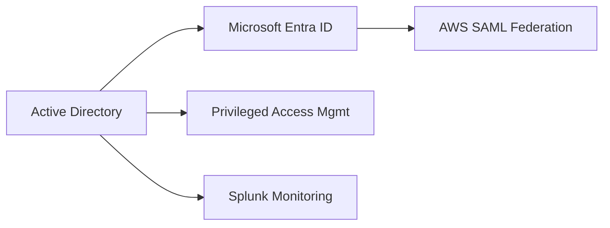

# 🎯 Enterprise Identity Security Lab (IAM / PAM)

9-module enterprise identity lab covering Active Directory, Microsoft Entra ID, AWS SAML, PAM, and Splunk.
Built under real failure conditions — authentication broke, was diagnosed, and repaired.
Each module is validated with screenshots and operational evidence.

---


---

## 🧠 Overview

This repository documents a simulated enterprise identity environment built to understand how authentication, authorization, and privileged access behave in a real-world setting.

This is not just a setup lab.

During this build, authentication failed, identity synchronization broke, and access control had to be diagnosed and repaired — mirroring real IAM/PAM engineering work.

---

## 🏗️ Architecture (High-Level)



---

## 🔍 What This Lab Demonstrates

• Active Directory (Kerberos, secure channel repair, domain trust)
• Microsoft Entra ID (hybrid identity synchronization)
• AWS SAML federation (centralized identity access)
• Privileged Access Management (role isolation, admin control)
• Identity governance (RBAC, lifecycle, separation of duties)
• Splunk monitoring (authentication + privilege activity)
• Identity automation and detection workflows

---

## 🏢 Simulated Organization

**Organization:** Fairmont Manufacturing (fictional)
**Primary Identity:** Jane Doe — Finance Department

---

## 🔥 Key Engineering Incidents

### 1. Kerberos Authentication Failure

* Domain trust broke due to time desynchronization
* Root cause: Domain Controller using local CMOS clock

**Fix implemented:**

```
External NTP → MGMT01 → DC01 → Domain Members
```

**Result:**
Authentication restored, secure channel repaired, domain stabilized

---

### 2. Entra Connect Authentication Failure

**Error:** "Unsupported Browser"

**Root Cause:**
Non-routable domain (`IAMPAM.LAB`) incompatible with Entra authentication

**Fix:**

* Added routable UPN suffix
* Updated identity configuration
* Re-ran synchronization

**Result:**
Hybrid identity successfully synchronized and validated

---

## 📸 Validation Example


---

## 📚 Lab Modules

* [Module 01 — Infrastructure](https://github.com/eespence/HYBRID-IDENTITY-ACCESS-MGMT/blob/main/modules/01-infrastructure.md)
* [Module 02 — Active Directory](https://github.com/eespence/HYBRID-IDENTITY-ACCESS-MGMT/blob/main/modules/02-active-directory.md)
* [Module 03 — Hybrid Identity](https://github.com/eespence/HYBRID-IDENTITY-ACCESS-MGMT/blob/main/modules/03-hybrid-identity.md)
* [Module 04 — Entra + AWS SAML Federation](https://github.com/eespence/HYBRID-IDENTITY-ACCESS-MGMT/blob/main/modules/04-entra-aws-saml-federation.md)
* [Module 05 — Identity Governance](https://github.com/eespence/HYBRID-IDENTITY-ACCESS-MGMT/blob/main/modules/05-identity-governance.md)
* [Module 06 — Privileged Access Management](https://github.com/eespence/HYBRID-IDENTITY-ACCESS-MGMT/blob/main/modules/06-privileged-access-management.md)
* [Module 07 — IAM & PAM Logging / Incident Response](https://github.com/eespence/HYBRID-IDENTITY-ACCESS-MGMT/blob/main/modules/07-iam-pam-logging-incident-response.md)
* [Module 08 — Identity Automation & Policy Enforcement](https://github.com/eespence/HYBRID-IDENTITY-ACCESS-MGMT/blob/main/modules/08-identity-automation-policy-enforcement.md)
* [Module 09 — Documentation & Architecture](https://github.com/eespence/HYBRID-IDENTITY-ACCESS-MGMT/blob/main/modules/09-documentation-architecture.md)

---

## 📁 Evidence Structure

Each module includes validation artifacts:

* screenshots/baseline/
* screenshots/connectivity/
* screenshots/module-02/
* screenshots/module-03/
* screenshots/module-04/
* screenshots/module-05/
* screenshots/module-06/
* screenshots/module-07/
* screenshots/module-08/
* screenshots/module-09/

---

**Edward E. Spence**
IAM / PAM Engineering | Identity Security

[LinkedIn](https://linkedin.com/in/edward-e-spence-6598bb312) | 
[Portfolio](https://edwards-it-portfolio.com)


---

## 📌 About

Enterprise identity lab demonstrating:

Active Directory, Microsoft Entra ID, AWS federation, RBAC governance, Privileged Access Management, and Splunk-based monitoring.

---

**E.E. Spence — Identity Engineering | IAMPAM.LAB**

---

