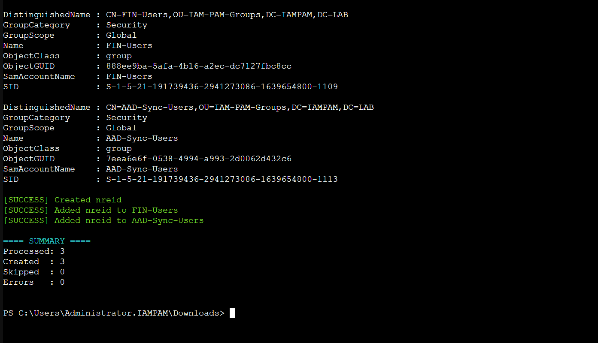
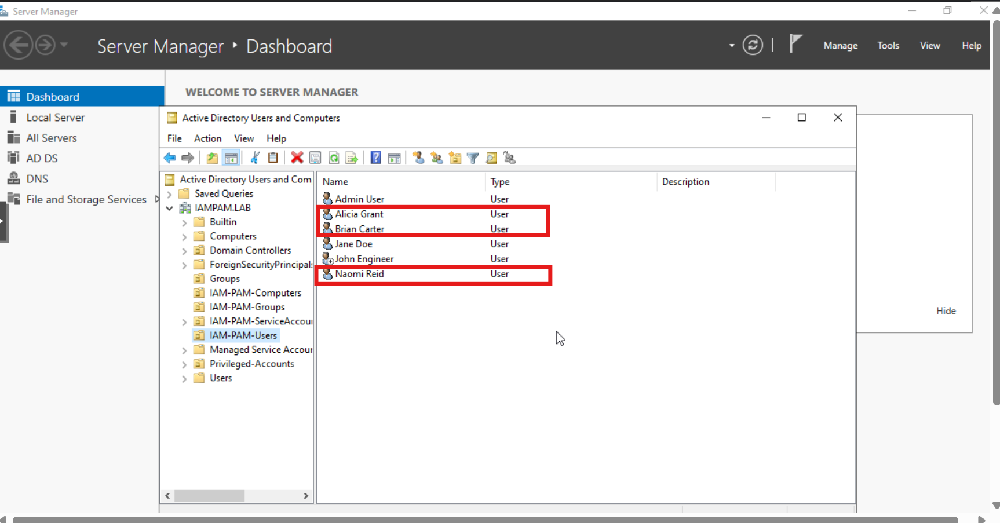
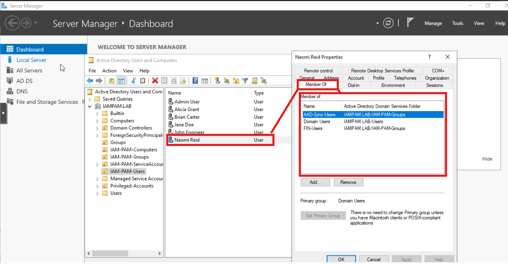

← [Back to Automation Modules](../README.md)


# 01 — User Lifecycle Automation

**Author:** Edward E. Spence  
**Lab:** HYBRID-IDENTITY-ACCESS-MGMT  
**Repo:** HYBRID-IDENTITY-ACCESS-MGMT  
**Version:** 1.1  
**Last Updated:** 2026-03-20

This module demonstrates automated user provisioning in an Active Directory environment using PowerShell. It covers bulk user creation, OU placement, group assignment, duplicate prevention, and optional sync-scoping through the existing `ADD-SYNC` security group used in the hybrid identity portion of the lab.

---

## 🎯 Objective

Automate the lifecycle of user account provisioning using a structured CSV input and PowerShell scripting, ensuring consistency, accuracy, and adherence to identity and access management principles.

---

## 🧱 Files

- `create-users.ps1` — PowerShell provisioning script
- `users.csv` — sample input file for bulk account creation
- `sample-output.txt` — example script execution output
- `README.md` — module documentation

---

## 🧠 What This Script Does

- imports user data from CSV
- validates required fields
- creates new Active Directory users
- places users into the correct Organizational Unit (OU)
- assigns one or more security groups
- prevents duplicate account creation
- handles errors without stopping execution
- supports safe execution using `-WhatIfMode`
- optionally adds users to `ADD-SYNC` when included in the CSV Groups field

---

## ⚙️ How It Works

1. Imports the Active Directory module.
2. Reads `users.csv` using `Import-Csv`.
3. Validates required values such as first name, last name, username, UPN, OU, and password.
4. Checks whether the target user already exists with `Get-ADUser`.
5. Confirms the OU exists with `Get-ADOrganizationalUnit`.
6. Confirms each listed security group exists with `Get-ADGroup`.
7. Creates the account with `New-ADUser`.
8. Adds the account to one or more groups with `Add-ADGroupMember`.
9. Prints a summary showing users created, skipped, group additions, and errors.

---

## 🧪 Example CSV Logic

The `Groups` column supports multiple groups separated by semicolons.

Example:

```csv
Alicia,Grant,agrant,agrant@iampam.lab,"OU=Sales,OU=Users,DC=iampam,DC=lab","Sales-Users;ADD-SYNC","P@ssw0rd!2026"
```

In that example, the user is:
- created in the Sales OU
- added to the `Sales-Users` group
- added to the `ADD-SYNC` group for hybrid sync eligibility

---

## 🧠 Commands Used

- `Import-Module ActiveDirectory`
- `Import-Csv`
- `Get-ADUser`
- `Get-ADOrganizationalUnit`
- `Get-ADGroup`
- `New-ADUser`
- `Add-ADGroupMember`
- `ConvertTo-SecureString`
- `Try/Catch`

---

## 🧪 How to Run

Open PowerShell as an administrator on a domain-joined management server with the RSAT / Active Directory module installed.

### Dry Run

```powershell
Set-ExecutionPolicy Bypass -Scope Process
cd .\automation\01-user-lifecycle
.\create-users.ps1 -WhatIfMode
```

### Live Run

```powershell
Set-ExecutionPolicy Bypass -Scope Process
cd .\automation\01-user-lifecycle
.\create-users.ps1
```

---

## 💣 Break It On Purpose

### Test 1 — Invalid OU
Change one CSV row to a non-existent OU.

Expected result:
- that row fails
- OU validation error is logged

### Test 2 — Invalid Group
Change one group name in the CSV to a group that does not exist.

Expected result:
- that row fails
- missing group error is logged

### Test 3 — Duplicate User
Run the script twice with the same CSV.

Expected result:
- existing users are skipped
- duplicate accounts are not created

### Test 4 — Missing Required Field
Remove a password, username, or UPN value from one CSV row.

Expected result:
- that row fails validation
- the script logs the error and continues

---

## ✅ Fix It

- correct the invalid OU distinguished name
- correct the invalid group name
- delete or rename duplicate test accounts if needed
- restore any missing required CSV fields
- re-run the script and confirm successful provisioning

---

## ✅ Lab Validation Checklist

- [ ] Confirm the target OUs exist in Active Directory Users and Computers
- [ ] Confirm the target groups exist, including `ADD-SYNC` if used
- [ ] Run the script with `-WhatIfMode` first
- [ ] Run the script normally
- [ ] Verify new accounts in the correct OUs
- [ ] Verify group memberships
- [ ] Verify `ADD-SYNC` membership for users meant to sync
- [ ] Capture screenshots and terminal output for the repo

---

## 📸 Screenshots

### User Creation Output


### Active Directory Users and Computers (OU Placement)


### Group Membership Validation


---

## 🎤 Interview Explanation

> This script automates user provisioning in Active Directory by using Import-Csv, Get-ADUser, Get-ADOrganizationalUnit, New-ADUser, and Add-ADGroupMember. It validates required input, checks OU and group existence, skips duplicate accounts, and logs row-level failures without stopping the entire run. It also supports optional hybrid sync scoping by adding users to ADD-SYNC when that group is included in the CSV.

---

## 🏁 Key Takeaways

- automation reduces manual provisioning errors
- structured CSV input improves consistency
- group-based assignment supports role-based access control
- duplicate checks and try/catch improve reliability
- `ADD-SYNC` can be included when hybrid sync eligibility is needed

---

**E.E. Spence — Identity Engineering | HYBRID-IDENTITY-ACCESS-MGMT**
