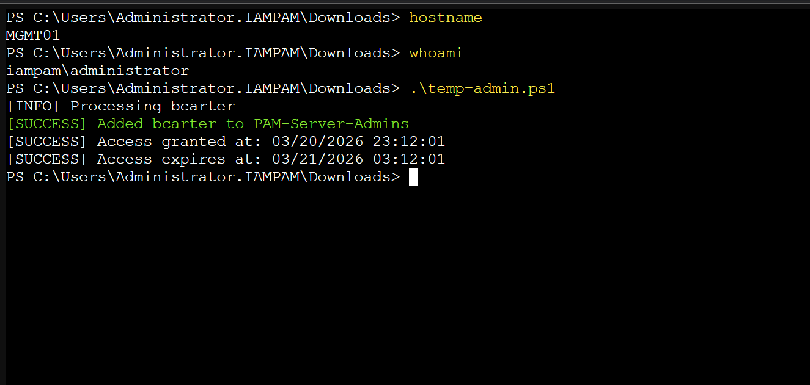
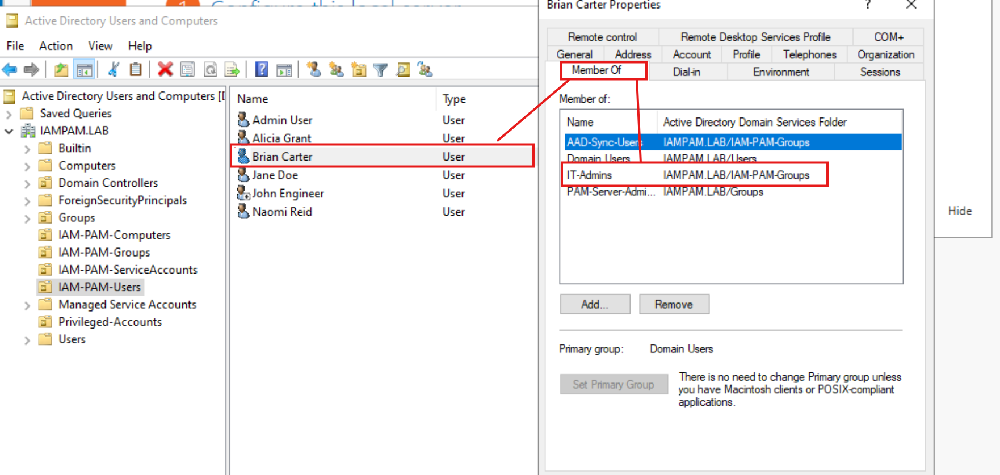
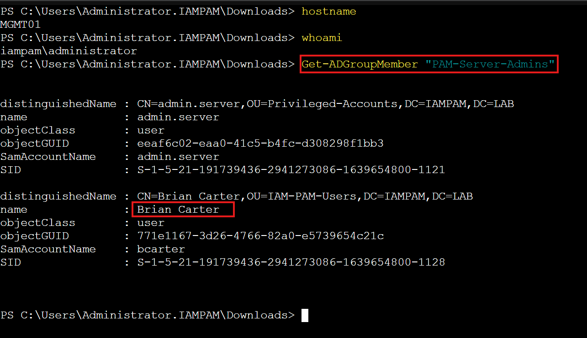

← [Back to Automation Modules](../README.md)


# 02 — PAM Temporary Access

This module demonstrates how to **grant controlled, time-bound privileged access** in Active Directory using PowerShell.

---

## 🎯 Objective

Simulate a Privileged Access Management (PAM) workflow by:

* Granting temporary administrative access
* Validating user and group existence
* Preventing duplicate assignments
* Logging access start and expiration time
* Supporting safe execution using `-WhatIfMode`

---

## 🧠 What This Script Does

The script:

1. Validates the target user exists
2. Validates the privileged group exists
3. Checks if the user is already a member
4. Adds the user to the privileged group
5. Calculates an expiration timestamp
6. Outputs access grant and expiration details

---

## 🛠️ Commands Used

* `Get-ADUser`
* `Get-ADGroup`
* `Get-ADGroupMember`
* `Add-ADGroupMember`
* `Get-Date`
* `Start-Transcript` / `Stop-Transcript`

---

## ⚙️ Script Parameters

| Parameter     | Description                                   |
| ------------- | --------------------------------------------- |
| Username      | Target user for elevation (default: bcarter)  |
| GroupName     | Privileged group (default: PAM-Server-Admins) |
| DurationHours | Length of access window                       |
| WhatIfMode    | Simulates execution without changes           |

---

## 🚀 How to Run

### Dry Run (Safe Simulation)

```powershell
.\temp-admin.ps1 -WhatIfMode
```

---

### Live Execution

```powershell
.\temp-admin.ps1
```

---

### Capture Output (Sample Artifact)

```powershell
Start-Transcript -Path .\sample-output.txt
.\temp-admin.ps1
Stop-Transcript
```

---

## 🔍 Validation Steps

### PowerShell Verification

```powershell
Get-ADGroupMember "PAM-Server-Admins"
```

---

### GUI Verification

```powershell
dsa.msc
```

Navigate to:

```
IAM-PAM-Groups → PAM-Server-Admins
```

Confirm the user appears as a member.

---

## 📸 Screenshots





---

## 🧪 Break It On Purpose

| Scenario              | Expected Result         |
| --------------------- | ----------------------- |
| Invalid username      | Script throws error     |
| Invalid group         | Validation fails        |
| User already in group | Script skips assignment |
| Missing parameter     | Script fails validation |

---

## 🧠 How It Works (Step-by-Step)

1. Imports Active Directory module
2. Reads input parameters
3. Validates user and group
4. Checks existing membership
5. Adds user to group if valid
6. Calculates expiration time
7. Outputs structured results

---

## 💬 Interview Explanation

This script automates temporary privileged access by validating a request, confirming the target user and privileged group exist, and adding the user to the approved admin group. It calculates an expiration window to support least privilege and ensures safe execution through validation and simulation modes.

---

## 🏁 Key Takeaways

* Demonstrates **Privileged Access Management concepts**
* Implements **least privilege via time-based elevation**
* Shows **safe automation practices (WhatIf mode)**
* Provides **verifiable audit output**

---

**E.E. Spence — Identity Engineering | IAMPAM.LAB**

