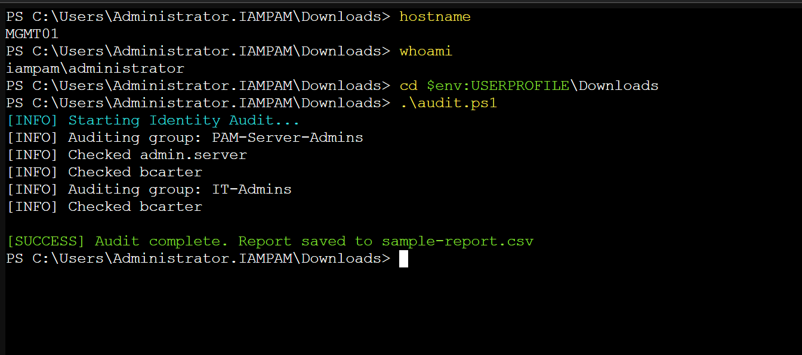
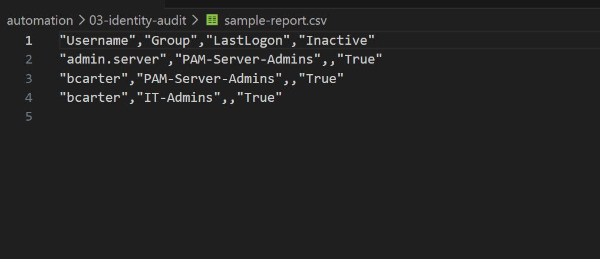
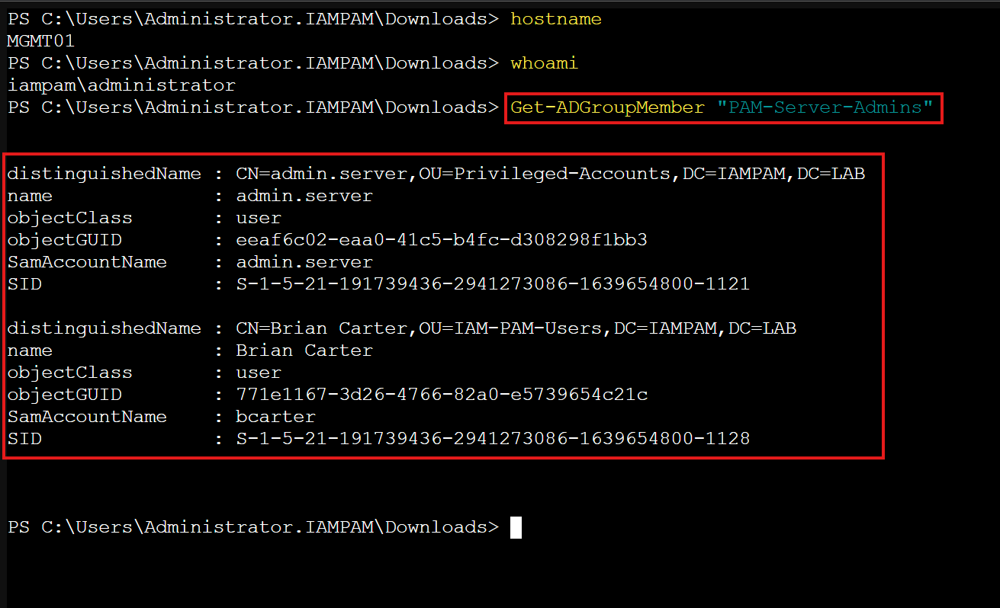

← [Back to Automation Modules](../README.md)


# 03 — Identity Audit

This module demonstrates how to **audit privileged access in Active Directory**, identify high-risk accounts, and generate a structured report for review.

---

## 🎯 Objective

Perform an identity audit to:

* Enumerate privileged group membership
* Identify users with elevated access
* Detect inactive accounts
* Export audit findings for review and analysis

---

## 🧠 What This Script Does

The script:

1. Targets privileged groups (`PAM-Server-Admins`, `IT-Admins`)
2. Retrieves all group members
3. Filters for user objects only
4. Pulls last logon activity
5. Flags inactive accounts based on a defined threshold
6. Exports results to a CSV report

---

## 🛠️ Commands Used

* `Get-ADGroupMember`
* `Get-ADUser`
* `Get-Date`
* `Export-Csv`

---

## ⚙️ Script Parameters

| Parameter    | Description                                               |
| ------------ | --------------------------------------------------------- |
| InactiveDays | Number of days used to determine inactivity (default: 30) |

---

## 🚀 How to Run

### Execute Audit

```powershell
.\audit.ps1
```

---

### Verify Report Exists

```powershell
dir sample-report.csv
```

---

### Open Report

```powershell
notepad sample-report.csv
```

---

## 🔍 Validation Steps

### PowerShell Validation

```powershell
Get-ADGroupMember "PAM-Server-Admins"
```

---

### Cross-Check Groups

```powershell
Get-ADGroupMember "IT-Admins"
```

---

## 📸 Screenshots





---

## 🧪 Break It On Purpose

| Scenario                   | Expected Result             |
| -------------------------- | --------------------------- |
| Non-existent group         | Script logs error           |
| User missing attributes    | Script continues processing |
| Empty group                | No results returned         |
| Inactive threshold changed | Different audit results     |

---

## 🧠 How It Works (Step-by-Step)

1. Imports Active Directory module
2. Defines target privileged groups
3. Calculates inactivity cutoff date
4. Queries group membership
5. Retrieves user attributes
6. Evaluates last logon activity
7. Flags inactive users
8. Exports structured audit report

---

## 💬 Interview Explanation

This script audits privileged access by enumerating administrative group membership and evaluating user activity levels. It identifies inactive accounts with elevated privileges and exports findings to a structured report, supporting visibility, risk detection, and access review processes.

---

## 🏁 Key Takeaways

* Demonstrates **identity visibility and audit capability**
* Identifies **risk from inactive privileged accounts**
* Uses **structured reporting for analysis**
* Reinforces **least privilege and access review practices**

---

**E.E. Spence — Identity Engineering | IAMPAM.LAB**

