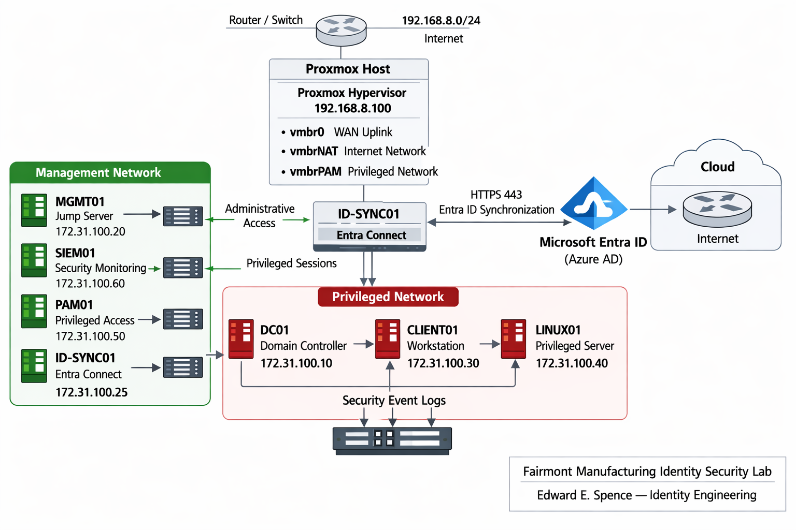

← [Back to Main README](../README.md)

---

---

# Module 01: Infrastructure & Network Architecture

**Module**: 01 - Infrastructure & Network Architecture
**VM Series**: 3000-3005
**Status**: ✅ **COMPLETE**
**Built by**: Edward E. Spence
**Date**: February 2026
**Purpose**: Enterprise-style IAM/PAM lab environment demonstrating architecture, security operations, and identity platform readiness

---

## 📋 Module Overview

This module establishes a dedicated, isolated IAM/PAM network environment on Proxmox VE that supports enterprise-grade identity operations.

---

## 🧱 Key Infrastructure Deliverables

* Dedicated network `172.31.100.0/24` on vmbrPAM
* NAT network `192.168.100.0/24` on vmbrNAT
* 7 virtual machines (VM IDs 3000-3005 & 3999)
* Network isolation and segmentation design
* Baseline snapshots on all systems
* Connectivity validation across all VMs
* Screenshot evidence captured

---

## 📸 Validation Example

---

## 🖥️ Proxmox Environment

**Host**: 192.168.8.100
**Storage**: local-zfs

**ISOs Used**:

* Windows Server 2022
* Windows 11 Pro
* Ubuntu 22.04 LTS

---

## 🌐 Network Architecture

| Network | Subnet           | Gateway       | Connected Systems | Purpose                    |
| ------- | ---------------- | ------------- | ----------------- | -------------------------- |
| vmbrPAM | 172.31.100.0/24  | 172.31.100.1  | All VMs           | Isolated IAM/PAM network   |
| vmbrNAT | 192.168.100.0/24 | 192.168.100.1 | Selected systems  | Controlled internet access |
| vmbr0   | 192.168.8.0/24   | 192.168.8.1   | Proxmox host      | Physical network           |

---

## 🧾 System Inventory

| VM ID | Hostname | Network       | OS                  | Status |
| ----- | -------- | ------------- | ------------------- | ------ |
| 3000  | DC01     | 172.31.100.10 | Windows Server 2022 | ✅      |
| 3001  | MGMT01   | Dual NIC      | Windows Server 2022 | ✅      |
| 3002  | CLIENT01 | 172.31.100.30 | Windows 11 Pro      | ✅      |
| 3003  | LINUX01  | 172.31.100.40 | Ubuntu 22.04 LTS    | ✅      |
| 3004  | PAM01    | Dual NIC      | Ubuntu 22.04 LTS    | ✅      |
| 3005  | SIEM01   | Dual NIC      | Ubuntu 22.04 LTS    | ✅      |
| 3999  |ID-SYNC01 | Dual NIC      | Windows Server 2022 | ✅      |
---

## 📚 Supporting Documentation

* `architecture/network-config.md`
* `architecture/architecture.md`
* `architecture/ip-allocation.md`
* `architecture/proxmox-vm-specs.md`

---

## ✅ Completion Checklist

### Network Configuration

* [x] vmbrPAM configured
* [x] vmbrNAT configured
* [x] NAT and routing validated

### VM Deployment

* [x] 7 VMs provisioned
* [x] OS installation completed
* [x] Network configuration validated

### Snapshots

* [x] Baseline snapshots created for all VMs
* [x] Naming convention standardized

### Validation

* [x] Full connectivity testing completed
* [x] Isolation confirmed
* [x] Internet access verified (dual-NIC systems)

### Documentation

* [x] Architecture documentation complete
* [x] Screenshots captured
* [x] Diagrams created

---

## 📊 Final Status

| Area           | Status     |
| -------------- | ---------- |
| Network Design | ✅ Complete |
| VM Deployment  | ✅ Complete |
| Connectivity   | ✅ Verified |
| Documentation  | ✅ Complete |
| Snapshots      | ✅ Complete |

---

## 🎓 Skills Demonstrated

* Proxmox virtualization and VM provisioning
* Network segmentation and isolation design
* Dual-homed network architecture
* Infrastructure validation and testing
* Enterprise documentation practices
* Snapshot and recovery planning

---

## 🚀 Transition to Module 02

Infrastructure is fully operational and validated.

Next phase:

* Active Directory Domain Services deployment
* Domain creation (IAMPAM.LAB)
* Domain joining systems
* Identity foundation setup

---

**Module Status**: ✅ COMPLETE
**Duration**: 2 Days

---

**E.E. Spence — Identity Engineering | IAMPAM.LAB**
