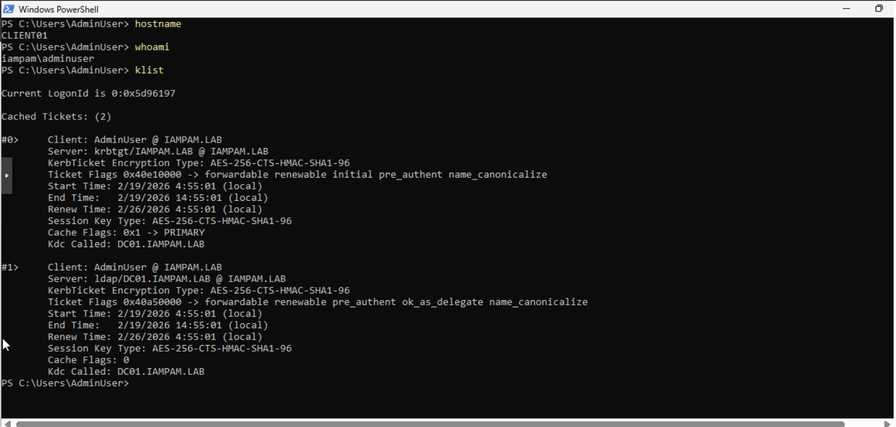

← [Back to Main README](../README.md)

---


---

# Module 02: On-Premises Identity (Active Directory)

**Module**: 02 - On-Premises Identity (Active Directory)
**Status**: ✅ **COMPLETE (Corrected & Validated)**
**Built by**: Edward E. Spence
**Completed**: February 14, 2026 *(Revised after infrastructure validation)*
**Purpose**: Establish centralized identity and authentication foundation for IAM/PAM lab

---

## 📋 Module Overview

This module establishes the on-premises identity foundation using Active Directory Domain Services, creating a centralized authentication and authorization platform for the IAM/PAM environment.

---

## 🧱 What Was Built

* Active Directory Domain Services installed on DC01
* Domain created: `IAMPAM.LAB`
* DNS configured and operational
* Organizational Units (OUs) structure created
* Domain user accounts provisioned
* Systems joined to domain
* Enterprise-correct Kerberos time hierarchy implemented

---

## 📸 Validation Evidence



---

## 🏗️ Active Directory Architecture

### Domain Information

| Property                | Value                |
| ----------------------- | -------------------- |
| Domain Name             | IAMPAM.LAB           |
| NetBIOS Name            | IAMPAM               |
| Forest Functional Level | Windows Server 2016  |
| Domain Functional Level | Windows Server 2016  |
| Domain Controller       | DC01 (172.31.100.10) |
| DNS Server              | DC01 (172.31.100.10) |

---

### Organizational Units Structure

| OU Name                 | Purpose              | Objects              |
| ----------------------- | -------------------- | -------------------- |
| IAM-PAM-Users           | Domain user accounts | Admin User, Jane Doe |
| IAM-PAM-Groups          | Security groups      | Reserved             |
| IAM-PAM-ServiceAccounts | Service identities   | Reserved             |
| IAM-PAM-Computers       | Domain systems       | CLIENT01, MGMT01     |

---

## 👥 User Accounts

| Name       | Username  | UPN                                                 | Status |
| ---------- | --------- | --------------------------------------------------- | ------ |
| Admin User | adminuser | [adminuser@iampam.lab](mailto:adminuser@iampam.lab) | ✅      |
| Jane Doe   | jdoe      | [jdoe@iampam.lab](mailto:jdoe@iampam.lab)           | ✅      |

---

## 💻 Domain-Joined Systems

| System   | OS                  | IP            | Status |
| -------- | ------------------- | ------------- | ------ |
| CLIENT01 | Windows 11          | 172.31.100.30 | ✅      |
| MGMT01   | Windows Server 2022 | 172.31.100.20 | ✅      |

---

## 🌐 DNS Configuration

| Zone                    | Type    | Status |
| ----------------------- | ------- | ------ |
| IAMPAM.LAB              | Forward | ✅      |
| 100.31.172.in-addr.arpa | Reverse | ✅      |

---

## 🔐 Kerberos Authentication Validation

Authentication was validated through successful Kerberos Ticket Granting Ticket (TGT) issuance.

This confirms:

* Domain trust is intact
* Secure channel is operational
* KDC (DC01) is functioning correctly
* Authentication pipeline is stable

---

## ⏱️ Critical Incident — Kerberos Time Drift

During validation, authentication failures were observed due to time desynchronization.

### Root Cause

DC01 (PDC Emulator) defaulted to:

* **Local CMOS Clock**
* No upstream time source
* Result: Kerberos ticket rejection

---

## 🏗️ Implemented Time Architecture

```
Internet NTP
     ↓
MGMT01 (NTP Relay)
     ↓
DC01 (PDC Emulator)
     ↓
Domain Members
```

---

## 🔧 Validated Configuration

### MGMT01

```
w32tm /query /source
pool.ntp.org
```

### DC01

```
w32tm /query /source
172.31.100.20,0x8
```

---

## ✅ Final State

| Component      | Status        |
| -------------- | ------------- |
| Domain         | ✅ Operational |
| DNS            | ✅ Resolving   |
| Authentication | ✅ Stable      |
| Kerberos       | ✅ Verified    |
| Time Sync      | ✅ Corrected   |

---

## 🎓 Skills Demonstrated

* Active Directory deployment
* Domain join operations
* DNS configuration
* OU design
* Kerberos troubleshooting
* Time hierarchy engineering
* Root cause analysis (identity failure)

---

## 🔐 Engineering Insight

This module demonstrates a **real-world identity failure scenario**:

Authentication did not fail due to configuration —
it failed due to **time authority design**, a common enterprise issue.

Fixing this required understanding:

* FSMO roles
* Kerberos dependency on time
* Network isolation constraints
* Internal NTP relay architecture

---

## 🚀 Next Module

Module 03 extends identity into hybrid architecture using Microsoft Entra ID synchronization.

---

**E.E. Spence — Identity Engineering | IAMPAM.LAB**
