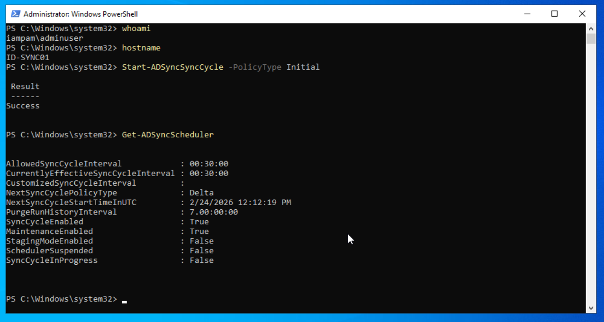
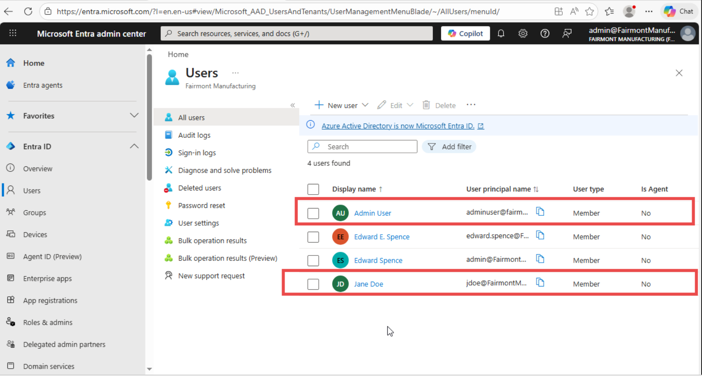

# Module 03: Hybrid Identity (Active Directory ↔ Microsoft Entra ID)

**Module**: 03 - Hybrid Identity (Active Directory ↔ Microsoft Entra ID)  
**Status**: ✅ COMPLETE (Validated After Synchronization & Namespace Correction)  
**Built by**: Edward E. Spence  
**Completed**: February 2026  
**Purpose**: Integrate on-premises Active Directory identities with Microsoft Entra ID using Microsoft Entra Connect to establish hybrid authentication and controlled cloud identity synchronization.

---

## Purpose

This module implemented a Hybrid Identity environment by integrating an on-premises Active Directory domain (**IAMPAM.LAB**) with Microsoft Entra ID (**fairmontmanufacturing.onmicrosoft.com**) using Microsoft Entra Connect.

This allows domain identities authenticated through Kerberos on-premises to also authenticate to Microsoft cloud services while Active Directory remains the authoritative identity provider.

This module documents:

• Server preparation  
• Connector deployment  
• Synchronization scope control  
• Authentication failure  
• Root cause analysis  
• Remediation  
• Operational validation

---

## Environment

**Domain:** IAMPAM.LAB  
**Tenant:** fairmontmanufacturing.onmicrosoft.com  
**Identity Model:** Hybrid Identity (Password Hash Synchronization)

### Systems Involved

| System | Role |
|------|------|
| DC01 | Domain Controller / DNS / Kerberos |
| ID-SYNC01 | Microsoft Entra Connect Synchronization Server |
| MGMT01 | Internet-connected administrative workstation |

DC01 is the authoritative DNS and authentication provider for all domain-joined systems.

---

## Hybrid Identity Concept

Active Directory remains the identity authority.

Microsoft Entra Connect synchronizes approved directory objects into Microsoft Entra ID. Cloud authentication becomes possible without replacing on-premises directory services.

Authentication path:

User → Active Directory (Kerberos) → Microsoft Entra Connect → Microsoft Entra ID → Cloud Services

---

## ID-SYNC01 Preparation

A dedicated synchronization server (ID-SYNC01) was domain-joined and validated prior to connector installation.

### Network Configuration

IP Address: 172.31.100.25  
DNS Server: 172.31.100.10 (DC01)

All domain systems use DC01 for DNS resolution.

---

## Validation Performed

The following checks were executed before installing Microsoft Entra Connect:

```powershell
whoami
Test-ComputerSecureChannel
ipconfig /all
nltest /dsgetdc:iampam.lab
w32tm /query /source
```

These checks confirm:

• Domain authentication context  
• Secure channel trust with the domain controller  
• DNS resolution to the domain controller  
• Domain controller discovery  
• Kerberos time synchronization  

Successful validation confirmed the server was ready for connector installation.

---

## Microsoft Entra Connect Installation

Microsoft Entra Connect was installed on ID-SYNC01.

### Configuration Choices

Installation Type: Custom  
Authentication Method: Password Hash Synchronization (PHS)

The connector was authenticated to:

• Microsoft Entra ID using Global Administrator credentials  
• Active Directory domain

The installation completed successfully after configuration prerequisites were satisfied.

---

## Synchronization Scope

Synchronization was configured using **Security Group-Based Filtering**.

Only users who are members of the Active Directory security group:

AAD-Sync-Users

are eligible to synchronize into Microsoft Entra ID.

Users must be explicitly added to this group before a cloud identity is created.

---

## Synchronization Verification

After installation, synchronization was validated.

```powershell
Get-ADSyncScheduler
Start-ADSyncSyncCycle -PolicyType Initial
```

Initially no users appeared in Microsoft Entra ID because no users were members of the AAD-Sync-Users group.

After adding users (Admin User and Jane Doe) to the AAD-Sync-Users group, a delta sync cycle was executed:

```powershell
Start-ADSyncSyncCycle -PolicyType Delta
```

Expected and observed result:

Users appeared in Microsoft Entra ID  
On-Premises Sync: Yes  
Source: Windows Server AD

This confirmed hybrid identity synchronization was operational.

---

## Post-Deployment Incident

During initial configuration of Microsoft Entra Connect, authentication failed.

Error displayed:

"Unsupported Browser"

Initial troubleshooting included:

• WebView2 runtime verification  
• Windows Account Manager troubleshooting  
• Service verification  
• Certificate trust verification  

None resolved the issue.

The error was misleading and not related to a browser.

---

## Root Cause Analysis

The Active Directory domain used a non-routable namespace:

IAMPAM.LAB

Microsoft Entra ID requires a routable UPN namespace during OAuth device registration.

Because the on-premises UPN namespace did not align with the Microsoft Entra tenant domain, the operating system could not construct a valid authentication security context. The authentication broker failed and produced a generic error.

This was an identity architecture issue, not a browser or software issue.

---

## Remediation

The issue was corrected by aligning identity namespaces.

Steps performed:

1. Added a routable UPN suffix to the Active Directory forest:  
   fairmontmanufacturing.onmicrosoft.com

2. Updated the administrator account UPN to match the new suffix.

3. Cleared Kerberos tickets:

```powershell
klist purge
```

4. Rebooted the synchronization server.

5. Re-ran Microsoft Entra Connect configuration.

Authentication succeeded after namespace alignment.

---

## Validation After Fix

After remediation:

• Microsoft Entra Connect authentication succeeded  
• Connector installation completed  
• Synchronization initialized  
• Users in AAD-Sync-Users synchronized to Microsoft Entra ID  
• Hybrid identity became operational

---

## Lessons Learned

• Hybrid identity requires namespace preparation before installation  
• Non-routable domains (.lab / .local) must be aligned to a routable UPN  
• Authentication broker errors may represent identity architecture failures  
• Successful connector installation does not guarantee users are in synchronization scope  
• Synchronization scope can be controlled using security group membership

The majority of troubleshooting time was spent investigating symptoms rather than validating identity prerequisites.

---

## Outcome

The environment successfully achieved:

Active Directory authentication on-premises  
+  
Microsoft Entra ID authentication in the cloud

Hybrid identity synchronization is operational and validated.

This module demonstrates implementation and troubleshooting of a real hybrid identity deployment.

---

# Verification Evidence

The following screenshots document validation, synchronization scope control, engine execution, and successful hybrid identity linkage.

---

## Synchronization Scope (Active Directory)

### AAD-Sync-Users Security Group


Only members of this group are synchronized into Microsoft Entra ID.

---

## Synchronization Execution (ID-SYNC01)

### ADSync Scheduler Enabled


Confirms the synchronization scheduler is enabled and running.

### Synchronization Service Manager — Successful Export


Confirms import, delta synchronization, and export operations completed successfully.

---

## Cloud Verification (Microsoft Entra ID)

### Scoped Users Visible in Entra


Only users added to AAD-Sync-Users appear in Microsoft Entra ID.

### On-Premises Directory Anchor Verified


Confirms:

• On-premises sync enabled  
• Domain: IAMPAM.LAB  
• Immutable ID present  
• Account mapped to Active Directory

---

**Built by**: Edward E. Spence  
**Environment**: IAMPAM.LAB  
**Systems**: DC01, ID-SYNC01, MGMT01  
**Platform**: Proxmox VE + Microsoft Entra ID
