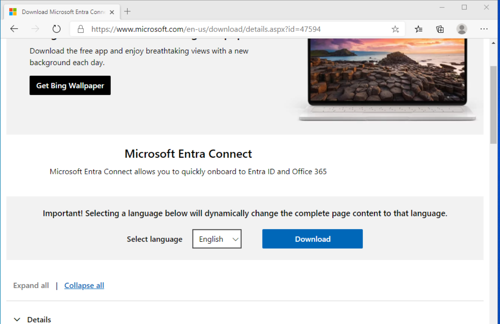
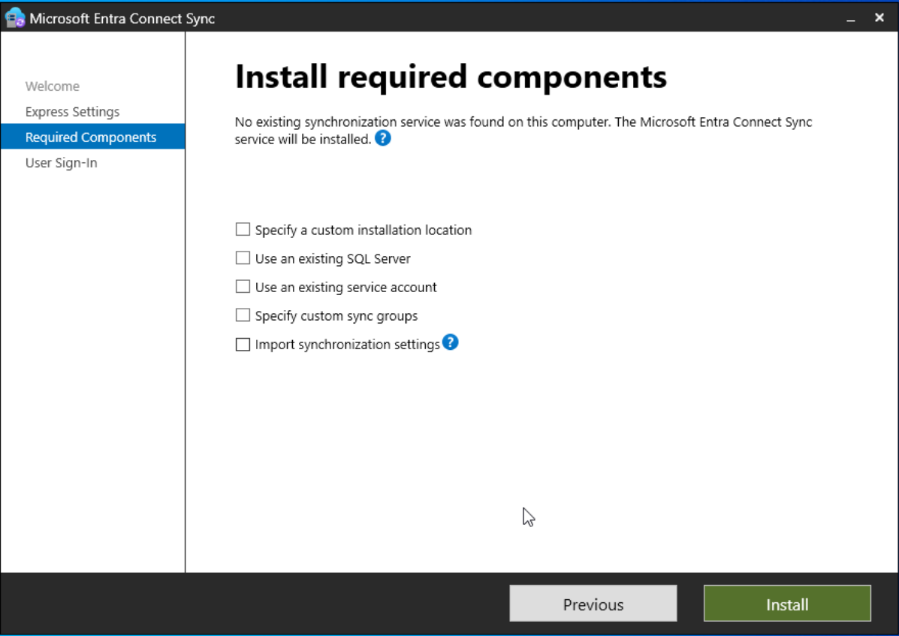
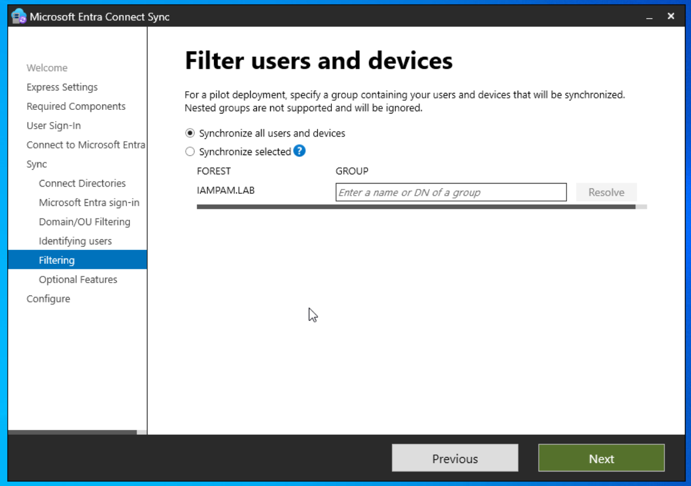
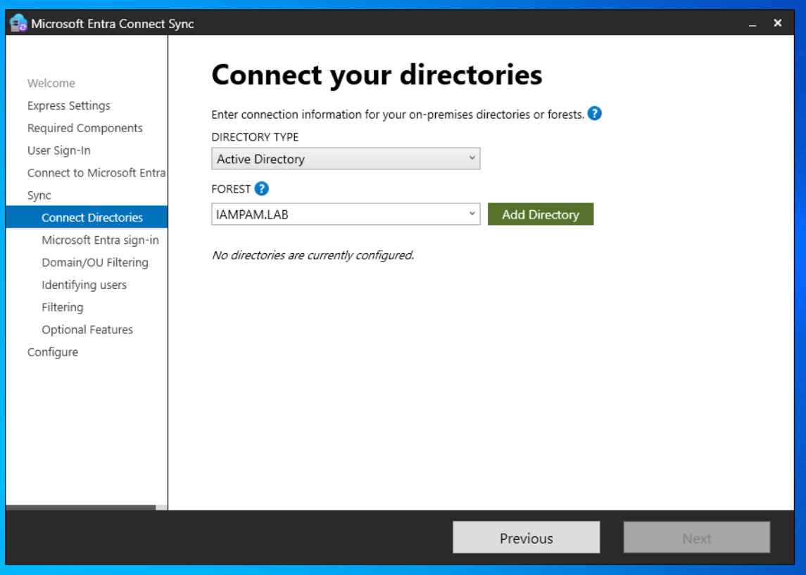
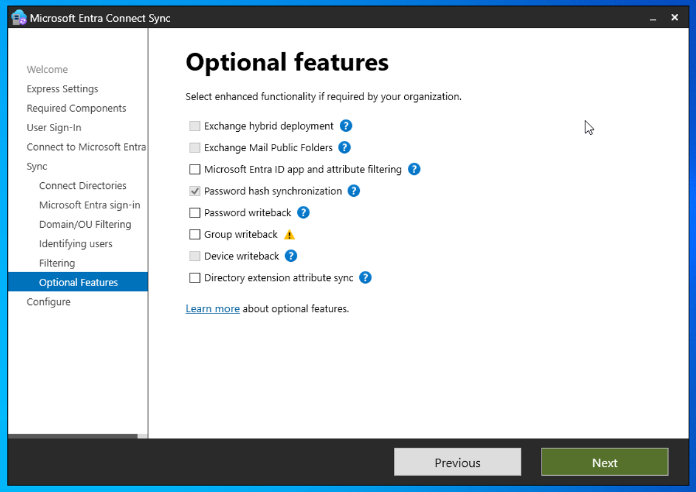

← [Back to Main README](../README.md)

---


---

# Module 03: Hybrid Identity (Active Directory ↔ Microsoft Entra ID)

**Module**: 03 - Hybrid Identity
**Status**: ✅ COMPLETE
**Built by**: Edward E. Spence
**Purpose**: Establish hybrid identity using Entra Connect with controlled synchronization.

---

## Hybrid Identity Overview

Active Directory remains the identity authority while Microsoft Entra ID enables cloud authentication.

---

## Root Cause (Incident)

```
IAMPAM.LAB ❌
fairmontmanufacturing.onmicrosoft.com ✅
```

Non-routable namespace caused authentication failure.

---

## Remediation Summary

* Added routable UPN suffix
* Updated admin UPN
* Cleared Kerberos tickets
* Re-ran Entra Connect

---

## 🔍 Verification Evidence

---

### AAD-Sync-Users Group (Scope Control)


---

### Sync Service Validation


---

### Entra User Verification


---

## ⚙️ Installation & Configuration Evidence

---

### Entra Connect Download Portal


---

### Entra Connect Download Page



---

### Required Components



---

### Group Filtering (AAD-Sync-Users)



---

### MFA Admin Approval



---

### Optional Features (Password Hash Sync)



---

### Kerberos Reset


---

## ✅ Final Status

| Component           | Status |
| ------------------- | ------ |
| Entra Connect       | ✅      |
| Namespace Alignment | ✅      |
| Sync Scope          | ✅      |
| Hybrid Auth         | ✅      |

---

## 🧠 Key Takeaway

Hybrid identity failures are almost always:

* Namespace issues
* Not tool issues

---

**E.E. Spence — Identity Engineering | IAMPAM.LAB**
