# Module 04: Identity Federation (Microsoft Entra ID ↔ AWS SAML SSO)

**Module**: 04 - Identity Federation (Microsoft Entra ID ↔ AWS IAM SAML SSO)  
**Status**: ✅ COMPLETE (Federated Authentication Validated)  
**Built by**: Edward E. Spence  
**Completed**: March 2026  
**Purpose**: Establish secure identity federation between Microsoft Entra ID and Amazon Web Services using SAML 2.0, allowing centralized authentication and role-based access to AWS without creating AWS IAM users.

---

This module extends the hybrid identity platform established in Module 03 by allowing Microsoft Entra ID to function as a federated identity provider for external cloud platforms.

Instead of creating separate AWS IAM users, authentication is centralized through Entra ID and access is granted through SAML-based role federation.

---

# Objective

Implement **Single Sign-On (SSO) federation** between **Microsoft Entra ID** and **Amazon Web Services (AWS)** using the **SAML 2.0 protocol**.

The goal of this module is to allow an authenticated Entra identity to **assume an AWS IAM role without using AWS credentials**, demonstrating enterprise-grade identity federation architecture.

Successful federation allows a user to:

```
Authenticate with Microsoft Entra ID
↓
Receive a signed SAML assertion
↓
Present the assertion to AWS
↓
Assume an IAM role using STS
↓
Access the AWS Management Console
```

---

# Architecture Overview

```
User
 │
 │ Authentication
 ▼
Microsoft Entra ID
(Identity Provider)
 │
 │ SAML Assertion
 ▼
AWS IAM Identity Provider
 │
 │ STS: AssumeRoleWithSAML
 ▼
AWS IAM Role
 │
 ▼
AWS Console Session
```

---

# Implementation Summary

This module performs the following configuration:

1. Create an **Enterprise Application in Entra ID**
2. Configure **SAML SSO**
3. Generate **Federation Metadata**
4. Upload metadata to **AWS IAM**
5. Create **AWS IAM SAML Identity Provider**
6. Create **Federated IAM Role**
7. Configure **Trust Relationship**
8. Map **SAML Claims**
9. Assign **User to Application**
10. Validate **Federated AWS Console Login**

---

# Operational Screenshots

---

## AWS Console Home

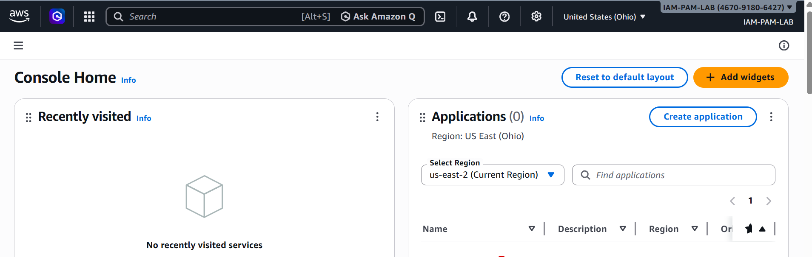

---

## Entra Enterprise Application Created

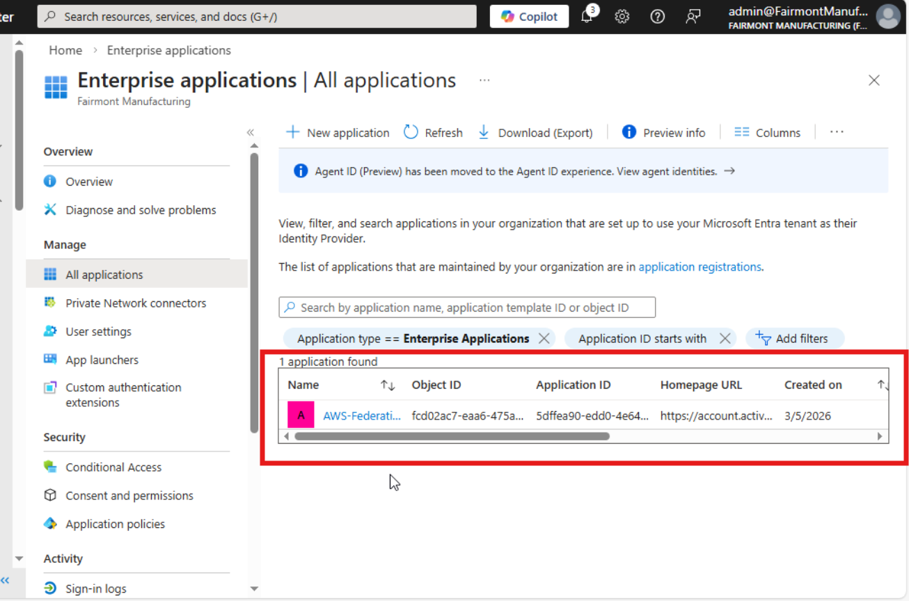

---

## SAML Configuration Applied

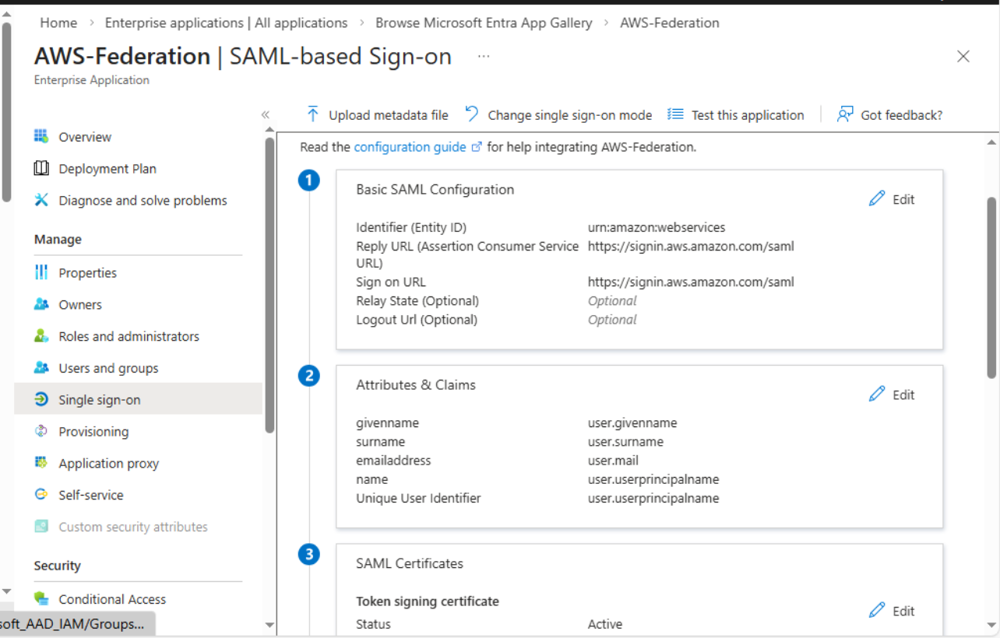

---

## Federation Metadata Generated

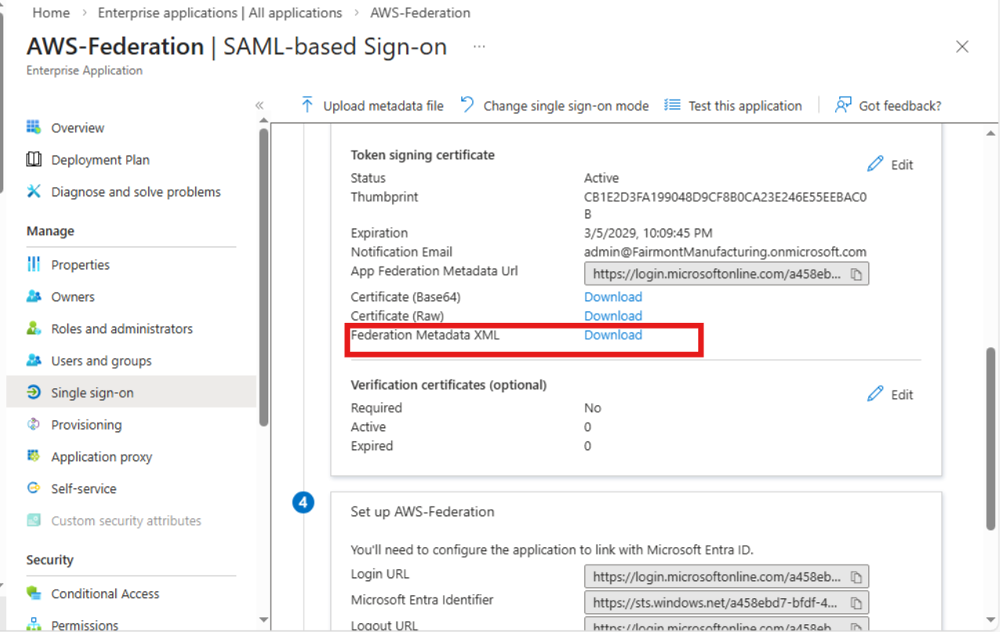

---

## AWS SAML Metadata Uploaded

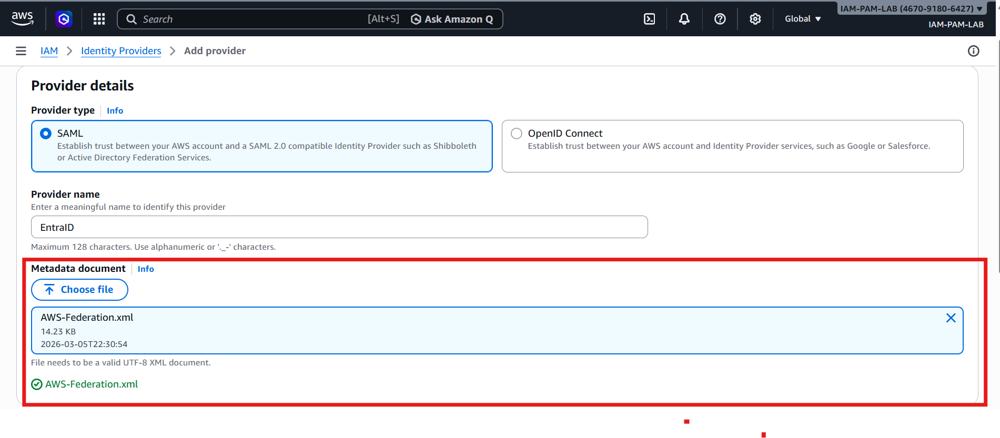

---

## AWS Identity Provider Created

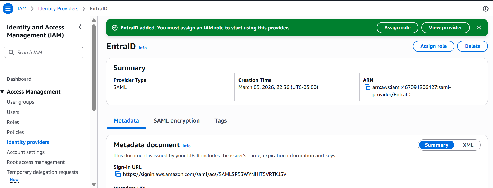

---

## AWS IAM Role Configuration

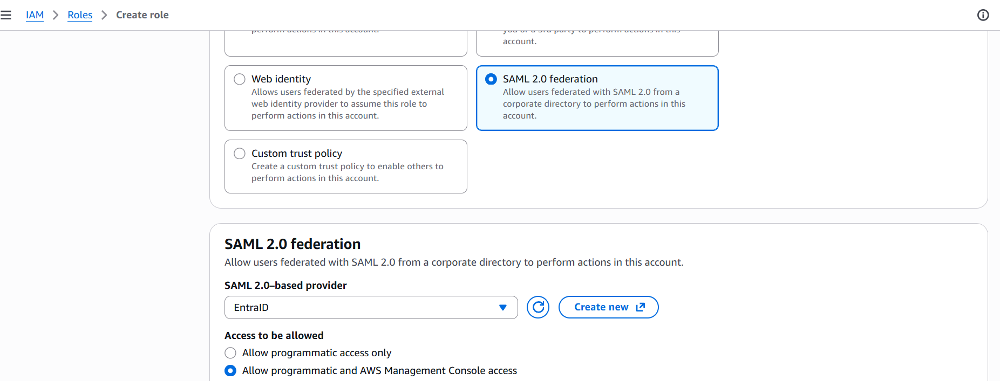

---

## Federated IAM Role Created

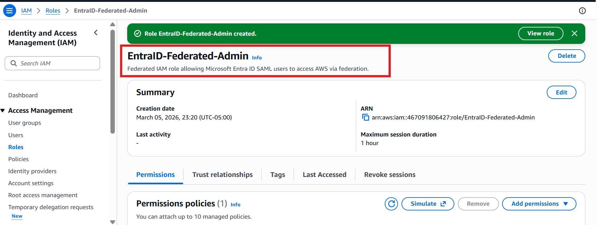

---

## AWS Federated Console Login Success

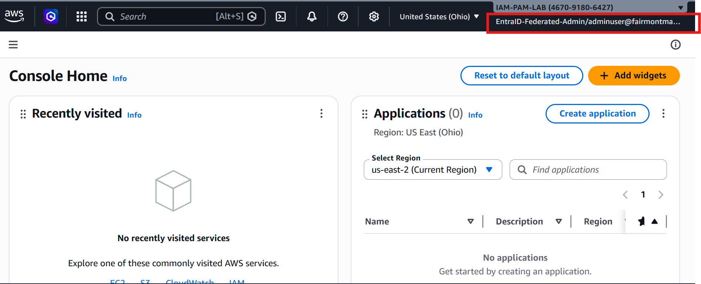

---

## AWS IAM Trust Policy

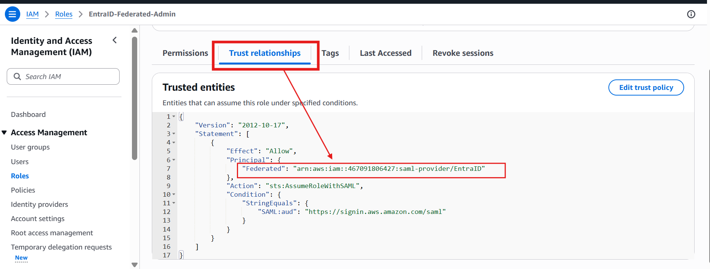

---

## Entra SAML Claim Mapping

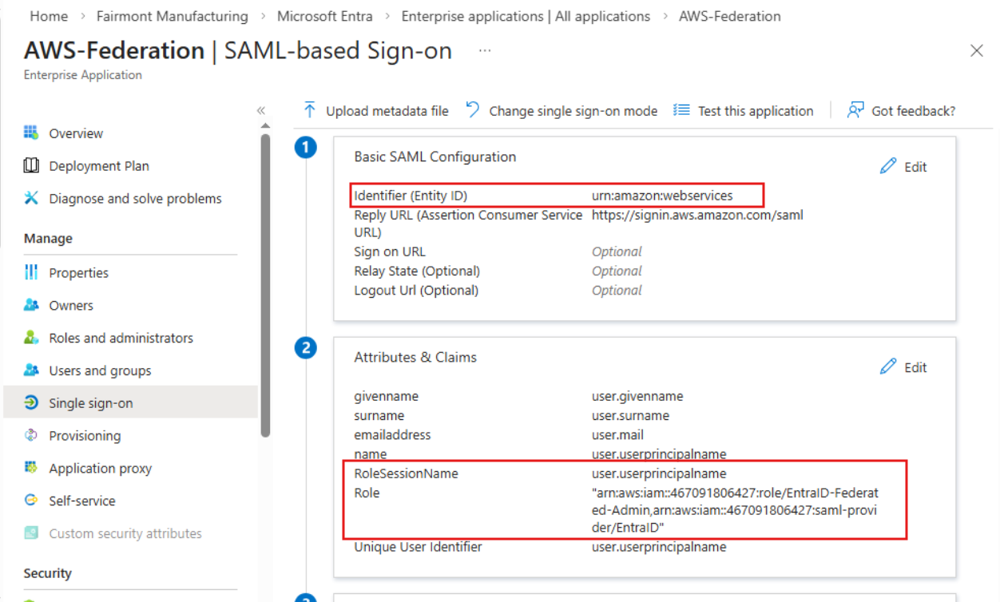

---

# Troubleshooting & Root Cause Analysis

During initial testing the federation login failed with the error:

```
Your request did not include a SAML response
```

## Root Cause

The **Sign-on URL field was populated** in the Entra SAML configuration:

```
https://signin.aws.amazon.com/saml
```

This forced Entra into **Service Provider initiated SSO mode**, which caused a redirect instead of a **SAML POST assertion** being sent to AWS.

Since AWS never received the SAML assertion, it returned the missing SAML response error.

---

## Resolution

The **Sign-on URL field was cleared**.

Configuration path:

```
Entra Admin Center
Enterprise Applications
AWS-Federation
Single Sign-On
Basic SAML Configuration
Edit
```

After removing the field, Entra treated the application as **IdP-initiated SSO**, allowing the MyApps tile to POST the SAML assertion directly to AWS.

---

## Result

Authentication succeeded and AWS console access was granted through federated role assumption.

Example session:

```
EntraID-Federated-Admin / adminuser@fairmontmanufacturing.onmicrosoft.com
```

---

# Security Benefits

Federated identity architecture improves security by:

* Eliminating AWS IAM user credentials
* Enforcing MFA through Entra ID
* Issuing short-lived AWS session credentials
* Centralizing identity lifecycle management
* Enforcing role-based access controls

---

# Skills Demonstrated

This module demonstrates practical implementation of:

* Identity Federation Architecture
* SAML 2.0 Authentication
* Cross-Platform Identity Trust
* AWS IAM Role Federation
* STS Temporary Credential Issuance
* Enterprise SSO Implementation
* Security Root Cause Analysis

---

# Next Module

The next module expands identity governance into **privileged access management and identity lifecycle control**.

---

**Built by**: Edward E. Spence  
**Environment**: IAMPAM.LAB  
**Systems**: DC01, ID-SYNC01, MGMT01  
**Platform**: Proxmox VE + Microsoft Entra ID + AWS IAM