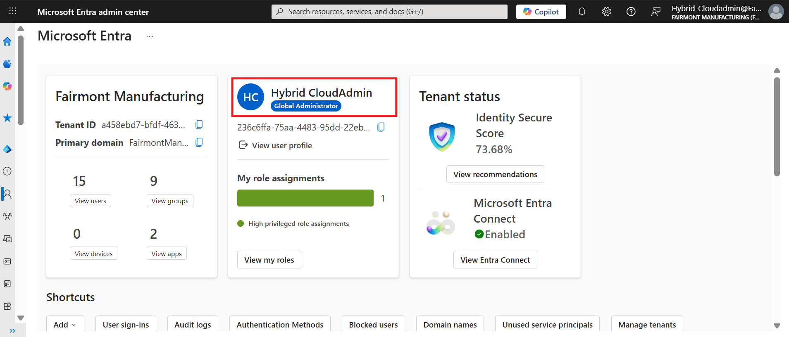
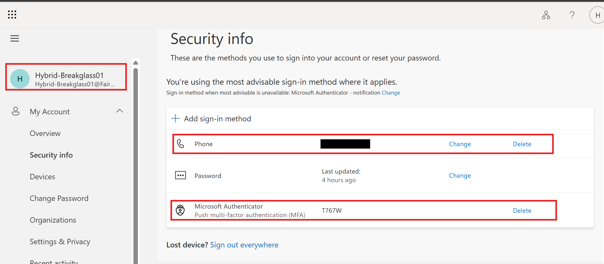
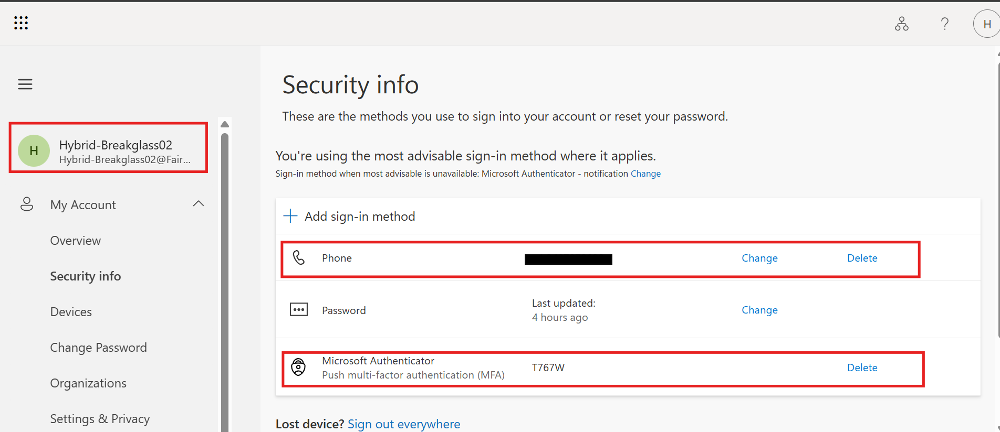

← [Back to Main README](../README.md)

---


---

# Module 05: Identity Governance

**Module**: 05 - Identity Governance
**Status**: ✅ COMPLETE (Identity Governance Controls Validated)
**Built by**: Edward E. Spence
**Completed**: March 2026
**Purpose**: Implement identity governance controls within the hybrid identity environment, demonstrating RBAC enforcement, identity lifecycle management, hybrid identity synchronization, privileged access review, and separation of duties.

---

## Tenant Governance Note

During the lifecycle of this project, the original Microsoft Entra tenant experienced an administrative recovery issue that affected access to cloud-based administrative functions.

To maintain operational continuity and preserve governance objectives, a replacement Microsoft Entra tenant was established under Fairmont Manufacturing LLC.

The underlying hybrid identity architecture, Active Directory environment, governance controls, synchronization model, RBAC implementation, and lifecycle management processes remained unchanged.

This adjustment provided an opportunity to implement additional governance safeguards, including:

* Dedicated cloud administration accounts
* Emergency break-glass administrator accounts
* Multi-factor authentication recovery controls
* Administrative account separation controls

These improvements are documented within Step 9 of this module.

---

## Overview

Module 05 implements **Identity Governance** controls within the hybrid identity environment established in the previous modules.
This phase introduces governance policies that control **who receives access, how access changes over time, and how access is audited**.

The objective of this module is to demonstrate how an enterprise identity platform enforces:

* Role Based Access Control (RBAC)
* Identity lifecycle management
* Hybrid identity synchronization
* Privileged access governance
* Separation of duties (SoD)

The governance controls are implemented across both the on-premises directory and the cloud identity platform.

---

## Architecture Context

The identity authority in this environment is **Active Directory**.
Identity objects synchronize to **Microsoft Entra ID** through **Entra Connect**.

The identity flow is:

Active Directory
↓
AAD-Sync-Users scope group
↓
Entra Connect synchronization
↓
Microsoft Entra ID

Only objects that belong to the **AAD-Sync-Users** group are eligible for synchronization.

This design implements **scoped directory synchronization**, preventing the entire directory from synchronizing to the cloud.

---

## Governance Model

The environment enforces **Role Based Access Control (RBAC)**.

Access follows this structure:

User
↓
Security Group
↓
Permissions

Users never receive permissions directly.
All permissions are inherited through group membership.

The governance security groups created for this module are:

* FIN-Users
* FIN-Managers
* FIN-Approvers
* FIN-Auditors
* ENG-Users
* SEC-Analysts
* IT-Admins

---

# Implementation

## Step 1 — Governance Security Groups

Governance groups were created inside the **IAM-PAM-Groups** organizational unit.

### Evidence


---

## Step 2 — Hybrid Group Synchronization

```powershell
Start-ADSyncSyncCycle -PolicyType Delta
```

### Evidence


---

## Step 3 — Joiner Lifecycle Event

User created:

```
John.Engineer
```

Assigned role: **ENG-Users**

### Evidence


---

## Step 4 — Hybrid User Synchronization

### Evidence


---

## Step 5 — Mover Lifecycle Event

Role change:

```
ENG-Users → SEC-Analysts
```

### Evidence


---

## Step 6 — Leaver Lifecycle Event

```powershell
Disable-ADAccount John.Engineer
```

### Evidence


---

## Step 7 — Privileged Access Review

```powershell
Get-ADGroupMember IT-Admins
```

### Evidence


---

## Step 8 — Separation of Duties Enforcement

### Evidence


---

## Step 9 — Administrative Resilience and Emergency Access Governance

During ongoing hybrid identity operations, an administrative recovery incident highlighted the importance of dedicated emergency access controls, recovery planning, and administrative account separation.

To strengthen identity governance and reduce the risk of tenant-level administrative lockout, the following controls were implemented:

* Dedicated operational cloud administration account (Hybrid-CloudAdmin)
* Primary emergency Global Administrator account (Hybrid-Breakglass01)
* Secondary emergency Global Administrator account (Hybrid-Breakglass02)
* Multi-factor authentication (MFA) enrollment for emergency access accounts
* Independent recovery methods utilizing Microsoft Authenticator and phone-based recovery
* Administrative account separation between operational and emergency access functions

The implementation of dedicated emergency access accounts ensures that administrative recovery paths remain available during authentication failures, account compromise investigations, credential recovery events, or administrative access disruptions.

These controls align with enterprise identity governance best practices by establishing resilient administrative access mechanisms, reducing single points of failure, and supporting continuity of operations within the hybrid identity environment.


### Evidence








---

# Security Controls Demonstrated

RBAC Governance

Hybrid Identity Synchronization

Identity Lifecycle Management (Joiner / Mover / Leaver)

Privileged Access Review

Separation of Duties Enforcement

Administrative Resilience

Emergency Access Governance

Multi-Factor Authentication Governancet


---

# Summary

Module 05 demonstrates how identity governance policies control access across a hybrid identity environment.

Through RBAC group design, lifecycle management, and governance auditing, the system ensures that access is granted appropriately, reviewed regularly, and revoked when no longer required.

---

## 📊 Final Status

| Control                                | Status         |
| -------------------------------------- | -------------- |
| RBAC Groups                            | ✅ Implemented |
| Hybrid Sync                            | ✅ Validated |
| Joiner/Mover/Leaver                    | ✅ Demonstrated |
| Privileged Access Review               | ✅ Complete |
| Separation of Duties                   | ✅ Enforced |
| Emergency Access Governance            | ✅ Implemented |
| Administrative Resilience Controls     | ✅ Implemented |

---

# Next Module

Module 06 introduces **Privileged Access Management (PAM)**.

---

---

**E.E. Spence — Identity Engineering | IAMPAM.LAB**
