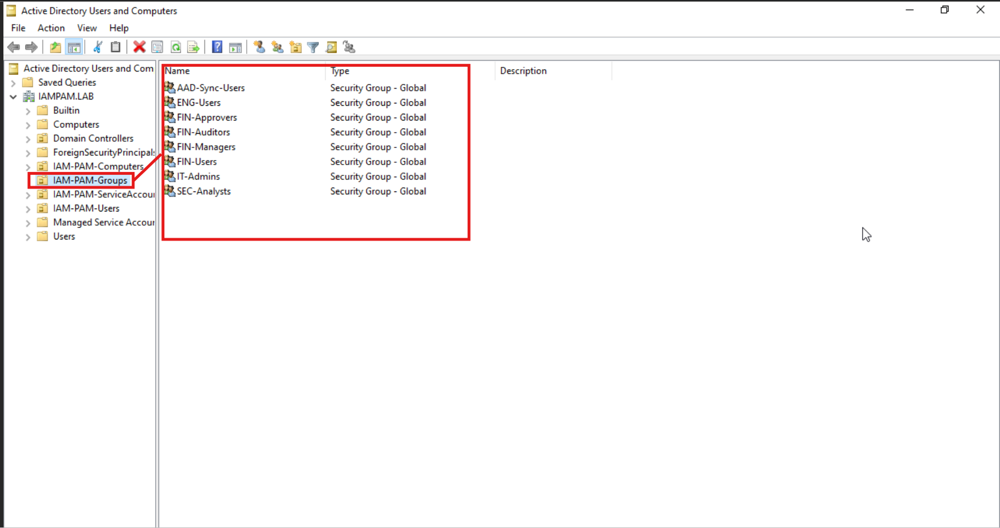
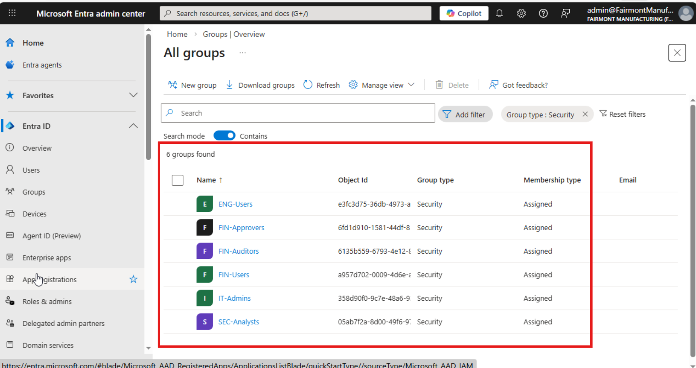
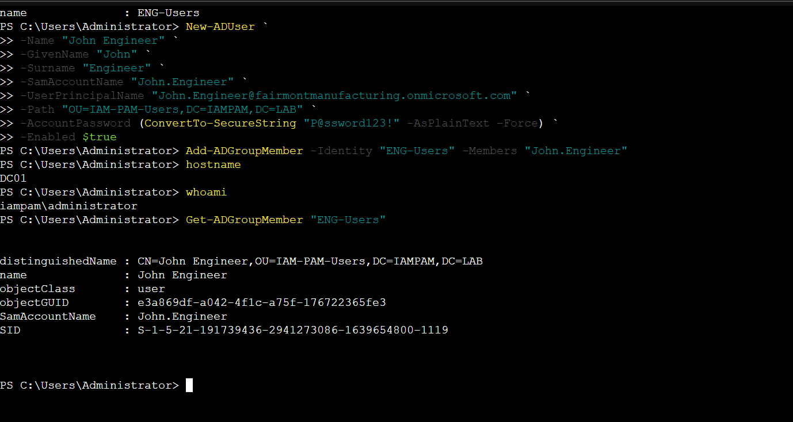
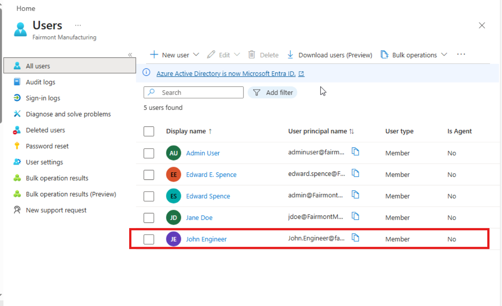
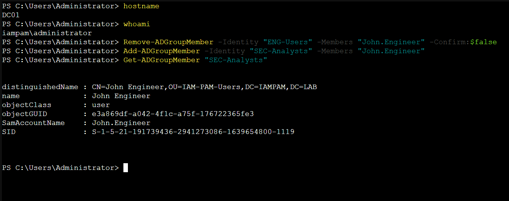
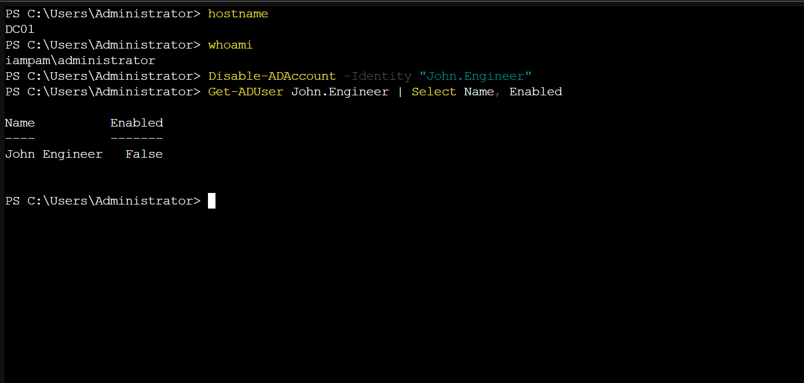
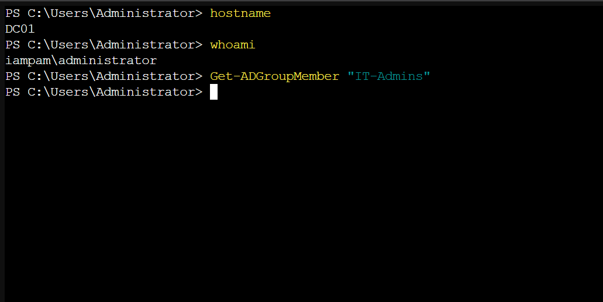
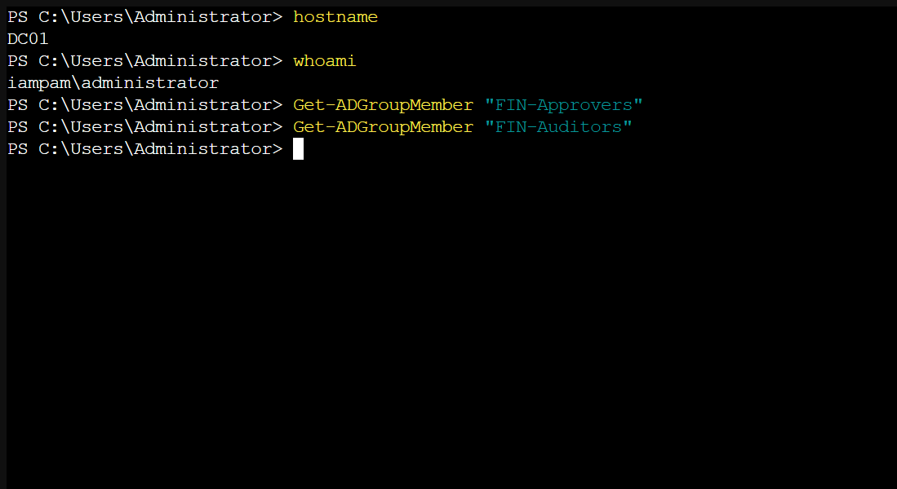

# Module 05: Identity Governance

**Module**: 05 - Identity Governance  
**Status**: ✅ COMPLETE (Identity Governance Controls Validated)  
**Built by**: Edward E. Spence  
**Completed**: March 2026  
**Purpose**: Implement identity governance controls within the hybrid identity environment, demonstrating RBAC enforcement, identity lifecycle management, hybrid identity synchronization, privileged access review, and separation of duties.

---

## Overview

Module 05 implements **Identity Governance** controls within the hybrid identity environment established in the previous modules.
This phase introduces governance policies that control **who receives access, how access changes over time, and how access is audited**.

The objective of this module is to demonstrate how an enterprise identity platform enforces:

* Role Based Access Control (RBAC)
* Identity lifecycle management
* Hybrid identity synchronization
* Privileged access governance
* Separation of duties (SoD)

The governance controls are implemented across both the on-premises directory and the cloud identity platform.

---

## Architecture Context

The identity authority in this environment is **Active Directory**.
Identity objects synchronize to **Microsoft Entra ID** through **Entra Connect**.

The identity flow is:

Active Directory
↓
AAD-Sync-Users scope group
↓
Entra Connect synchronization
↓
Microsoft Entra ID

Only objects that belong to the **AAD-Sync-Users** group are eligible for synchronization.

This design implements **scoped directory synchronization**, preventing the entire directory from synchronizing to the cloud.

---

## Governance Model

The environment enforces **Role Based Access Control (RBAC)**.

Access follows this structure:

User
↓
Security Group
↓
Permissions

Users never receive permissions directly.
All permissions are inherited through group membership.

The governance security groups created for this module are:

* FIN-Users
* FIN-Managers
* FIN-Approvers
* FIN-Auditors
* ENG-Users
* SEC-Analysts
* IT-Admins

---

# Implementation

## Step 1 — Governance Security Groups

Governance groups were created inside the **IAM-PAM-Groups** organizational unit.

These groups represent enterprise RBAC roles used to grant access to systems and applications.

### Evidence



This image confirms the governance RBAC groups were successfully created in Active Directory.

### Control Demonstrated

RBAC Governance Structure

---

## Step 2 — Hybrid Group Synchronization

After creation, the governance groups were added to the **AAD-Sync-Users** scope group so they could synchronize to Microsoft Entra ID.

A synchronization cycle was then triggered on the Entra Connect server.

```
Start-ADSyncSyncCycle -PolicyType Delta
```

### Evidence



This image confirms the governance groups successfully synchronized to the cloud identity platform.

### Control Demonstrated

Hybrid Identity Governance

---

## Step 3 — Joiner Lifecycle Event

A new employee identity was created to simulate onboarding.

User created:

```
John.Engineer
```

The identity was assigned the **ENG-Users** role.

This demonstrates that access is assigned through group membership rather than direct permission assignment.

### Evidence



This image confirms the new user account was created and assigned to the engineering RBAC role.

### Control Demonstrated

Identity Lifecycle Management — Joiner Event

---

## Step 4 — Hybrid User Synchronization

After the user was created, the identity was added to the **AAD-Sync-Users** scope group and synchronized to Microsoft Entra ID.

This demonstrates hybrid identity onboarding.

### Evidence



This image confirms the new employee identity successfully synchronized to Microsoft Entra.

### Control Demonstrated

Hybrid Identity Synchronization

---

## Step 5 — Mover Lifecycle Event

A department transfer was simulated to demonstrate RBAC reassignment.

User moved from:

```
ENG-Users
```

to:

```
SEC-Analysts
```

This demonstrates how access changes when an employee changes roles.

Permissions are automatically updated through group membership.

### Evidence



This image confirms the user's role membership was successfully changed.

### Control Demonstrated

Identity Lifecycle Management — Mover Event

---

## Step 6 — Leaver Lifecycle Event

A termination scenario was simulated by disabling the user account.

```
Disable-ADAccount John.Engineer
```

Disabling the account immediately blocks authentication and removes access.

### Evidence



This image confirms the user account was successfully disabled.

### Control Demonstrated

Identity Lifecycle Management — Leaver Event

---

## Step 7 — Privileged Access Review

Administrative privileges must be periodically reviewed to ensure that only authorized personnel hold elevated access.

The **IT-Admins** group was audited.

```
Get-ADGroupMember IT-Admins
```

### Evidence



This image confirms that no unauthorized accounts were present in the privileged administrator group.

### Control Demonstrated

Privileged Access Governance

---

## Step 8 — Separation of Duties Enforcement

Separation of Duties prevents conflicts of interest within financial systems.

The following roles must never overlap:

```
FIN-Approvers
FIN-Auditors
```

Membership of both groups was verified to ensure no user holds both roles.

### Evidence



This image confirms that no identity belongs to both financial governance roles.

### Control Demonstrated

Separation of Duties (SoD)

---

# Security Controls Demonstrated

This module implemented multiple identity governance controls.

RBAC Governance  
Hybrid Identity Synchronization  
Identity Lifecycle Management (Joiner / Mover / Leaver)  
Privileged Access Review  
Separation of Duties Enforcement  

These controls align with governance frameworks used in enterprise environments and regulatory compliance programs.

---

# Summary

Module 05 demonstrates how identity governance policies control access across a hybrid identity environment.

Through RBAC group design, lifecycle management, and governance auditing, the system ensures that access is granted appropriately, reviewed regularly, and revoked when no longer required.

This module establishes the governance layer required before introducing **Privileged Access Management (PAM)** controls in the next phase of the architecture.

---

# Next Module

Module 06 introduces **Privileged Access Management (PAM)**, which will implement controls for:

* privileged account isolation
* just-in-time privilege elevation
* administrative session auditing
* privileged access approval workflows

---

**Built by**: Edward E. Spence  
**Environment**: IAMPAM.LAB  
**Systems**: DC01, ID-SYNC01, MGMT01  
**Platform**: Proxmox VE + Microsoft Entra ID + AWS IAM
