# Module 06: Privileged Access Management

**Module**: 06 - Privileged Access Management
**Status**: ✅ COMPLETE (Privileged Access Controls Validated)
**Built by**: Edward E. Spence
**Completed**: March 2026
**Purpose**: Implement privileged access management controls within the hybrid identity architecture, demonstrating privileged account isolation, role-based administrative delegation, administrative workstation enforcement, cross-platform privileged management, and privileged access auditing.

---

## Overview

Module 06 implements **Privileged Access Management (PAM)** controls within the hybrid identity architecture.

This phase introduces security controls designed to protect **administrative identities, elevated privileges, and privileged access paths**.

The objective of this module is to demonstrate how enterprise identity environments secure privileged access through:

* Privileged account isolation
* Role-based privileged delegation
* Administrative workstation enforcement
* Cross-platform administrative control
* Privileged access auditing

Privileged identities represent **high-risk access paths**. For this reason, they must be separated from standard user accounts and governed by additional security controls.

This module introduces a **dedicated privileged identity model** inside Active Directory.

---

# Architecture Context

The privileged access architecture follows a **separation of privilege model**.

Standard user identities are used for daily work, while **administrative identities are used exclusively for elevated tasks**.

Access flow:

```
Standard User
↓
Administrative Identity
↓
PAM Security Group
↓
Privileged System Access
```

Administrative operations originate from a **dedicated administrative workstation**.

Privileged access targets in this environment include:

* **DC01** — Domain Controller
* **MGMT01** — Administrative Workstation
* **LINUX01** — Privileged Linux Server

Privileged identities are intentionally **excluded from cloud synchronization** in order to reduce exposure of high-risk accounts.

---

# PAM Security Model

Privileged identities are stored in a dedicated organizational unit.

```
Privileged-Accounts
```

Administrative access is delegated using **PAM security groups**.

```
PAM-Domain-Admins
PAM-Server-Admins
PAM-Security-Admins
```

Administrative identities inherit permissions through group membership.

```
Administrative Identity
↓
PAM Security Group
↓
Privileged System Permissions
```

This model ensures:

* controlled privilege assignment
* simplified auditing
* reduced direct privilege exposure

---

# Implementation

## Step 1 — Privileged Accounts Organizational Unit

A dedicated organizational unit was created to store privileged administrative identities.

```
Privileged-Accounts
```

This organizational unit separates privileged identities from standard user accounts.

### Evidence

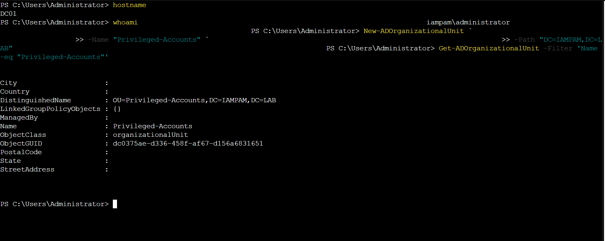

### Control Demonstrated

Privileged Identity Isolation

---

## Step 2 — Privileged Administrative Accounts

Dedicated administrative identities were created.

Examples include:

```
admin.dc01
admin.server
admin.security
```

These accounts are used only for privileged administrative activity.

### Evidence

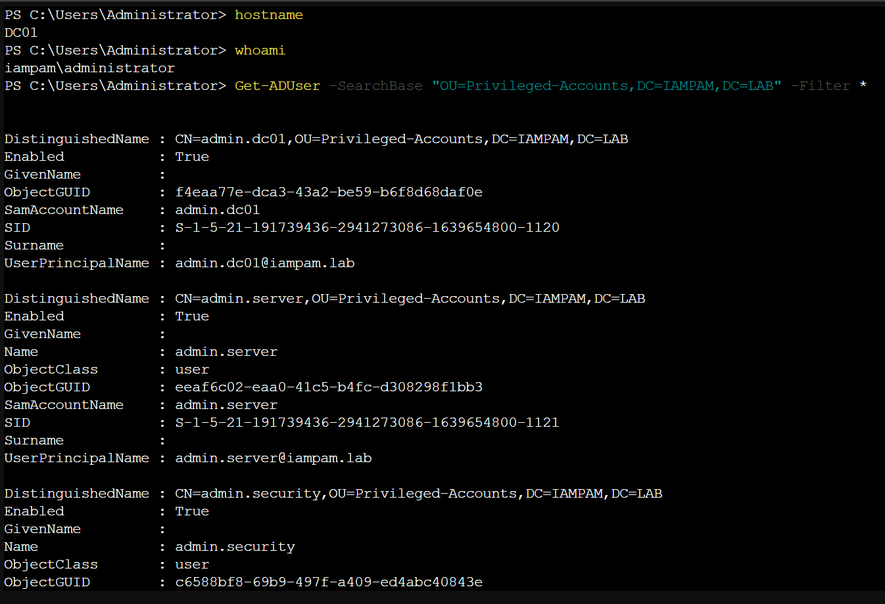

### Control Demonstrated

Privileged Identity Separation

---

## Step 3 — PAM Security Groups

Privileged access groups were created to implement role-based administrative delegation.

Groups created:

```
PAM-Domain-Admins
PAM-Server-Admins
PAM-Security-Admins
```

### Evidence

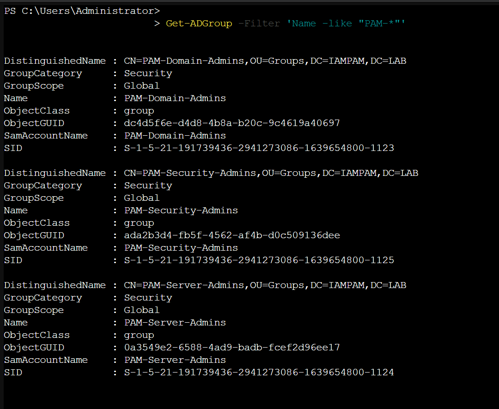

### Control Demonstrated

Privileged RBAC Delegation

---

## Step 4 — PAM Group Membership

Administrative identities were assigned to their corresponding PAM roles.

Example:

```
admin.dc01 → PAM-Domain-Admins
admin.server → PAM-Server-Admins
admin.security → PAM-Security-Admins
```

### Evidence

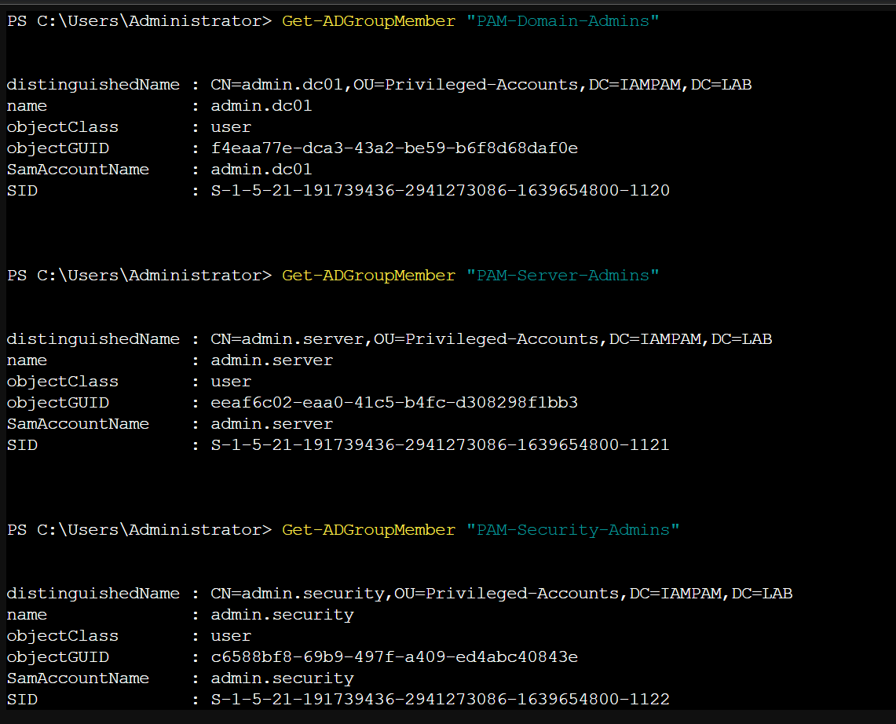

### Control Demonstrated

Role-Based Privileged Access

---

## Step 5 — Privilege Delegation Through Group Nesting

PAM groups were nested into privileged administrative groups.

Example:

```
PAM-Domain-Admins → Domain Admins
```

This allows privileged permissions to be inherited indirectly through PAM roles.

### Evidence

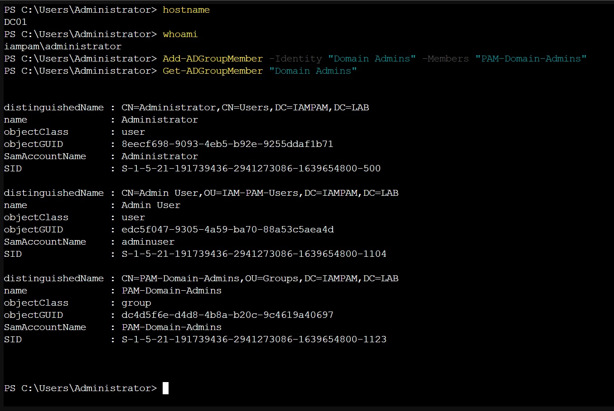

### Control Demonstrated

Indirect Privileged Access Delegation

---

## Step 6 — Administrative Workstation Access

Administrative identities were granted remote access to the **management workstation**.

```
MGMT01
```

The following group was used:

```
Remote Desktop Users
```

### Evidence

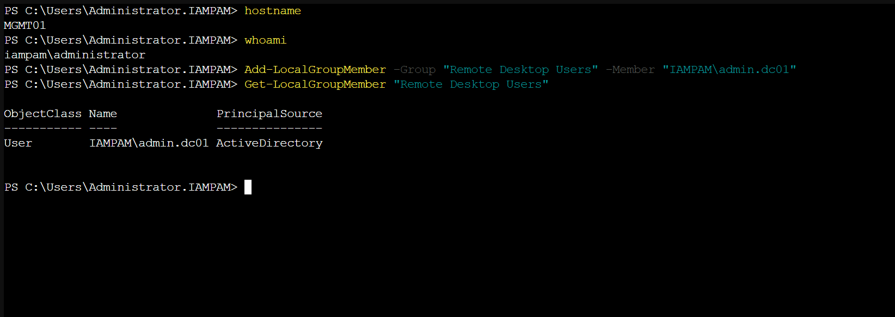

### Control Demonstrated

Administrative Workstation Enforcement

---

## Step 7 — Administrative Login Validation

Administrative access was tested by logging into the management workstation using a privileged identity.

Commands executed:

```
hostname
whoami
```

### Evidence

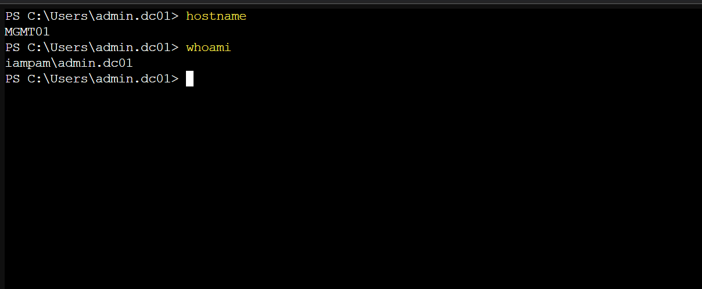

### Control Demonstrated

Administrative Session Validation

---

## Step 8 — Privilege Boundary Validation

Administrative access was tested on a standard workstation.

```
CLIENT01
```

This demonstrates the difference between administrative and standard workstation access contexts.

### Evidence

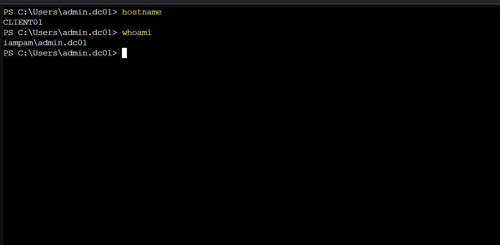

### Control Demonstrated

Privilege Boundary Awareness

---

## Step 9 — Linux Administrative Identity

A privileged Linux administrative account was created.

```
admin_server
```

The account was granted elevated privileges using:

```
sudo
```

### Evidence

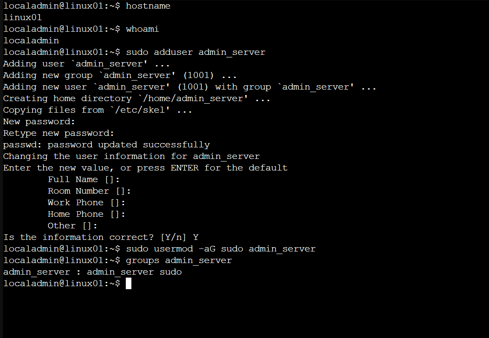

### Control Demonstrated

Cross-Platform Privileged Identity Management

---

## Step 10 — Linux Privilege Validation

Administrative privileges were verified using:

```
sudo -l
```

### Evidence

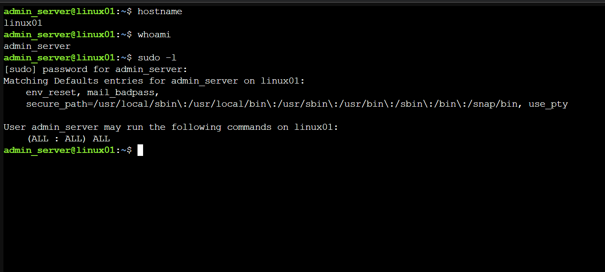

### Control Demonstrated

Privileged Command Authorization

---

## Step 11 — Privileged Access Review

Privileged roles must be periodically reviewed to ensure no unauthorized identities hold elevated access.

Administrative groups were audited using:

```
Get-ADGroupMember
```

### Evidence

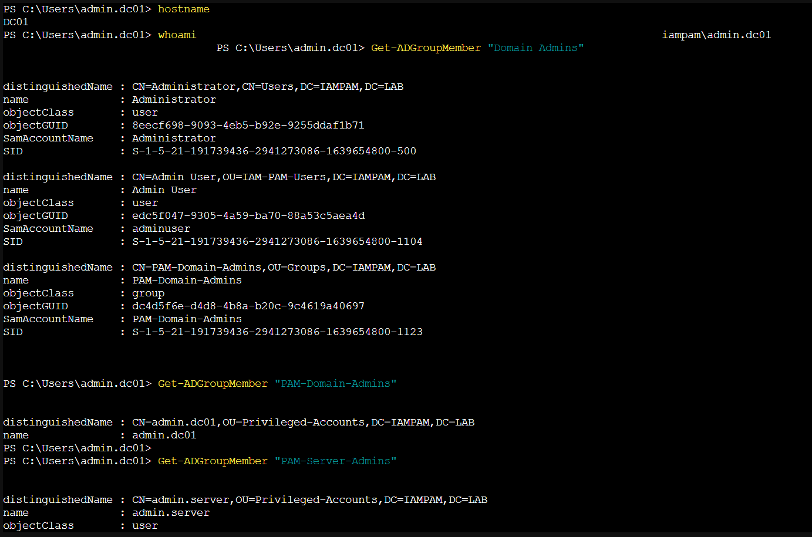

### Control Demonstrated

Privileged Access Governance

---

# Security Controls Demonstrated

This module implemented multiple privileged access protections.

* Privileged Identity Isolation
* Administrative Workstation Model
* Role-Based Privileged Delegation
* Cross-Platform Administrative Access
* Privileged Access Review
* Privileged Identity Separation from Standard Accounts

These controls align with enterprise privileged access protection strategies used in modern identity architectures.

---

# Summary

Module 06 demonstrates how privileged access is secured within a hybrid identity environment.

By isolating privileged identities, delegating administrative roles through PAM security groups, enforcing administrative workstation usage, and validating privileged access across both Windows and Linux systems, the environment ensures elevated privileges remain tightly controlled.

These protections reduce the attack surface associated with privileged identities and establish a strong security foundation for enterprise identity management.

---

# Next Module

Module 07 introduces **IAM & PAM Logging / Incident Response**, which will implement:

* identity authentication logging
* privileged access monitoring
* security event auditing
* incident detection through identity signals

---

**Built by**: Edward E. Spence
**Environment**: IAMPAM.LAB
**Systems**: DC01, MGMT01, LINUX01
**Platform**: Proxmox VE | Active Directory | Microsoft Entra ID

