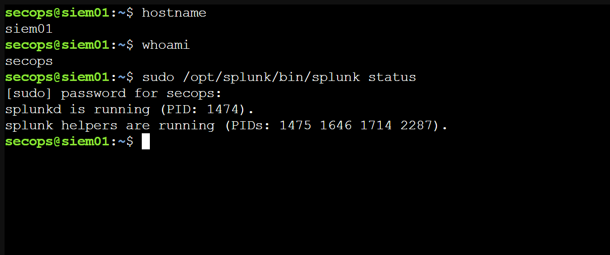
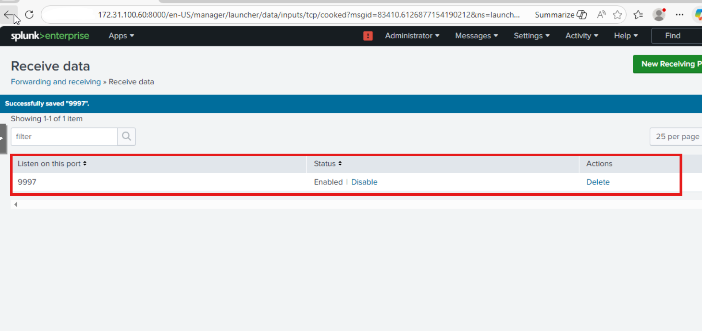
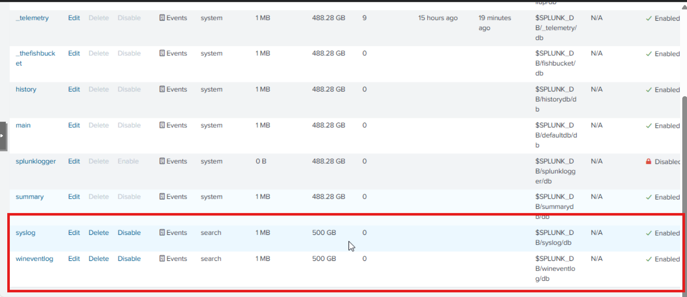
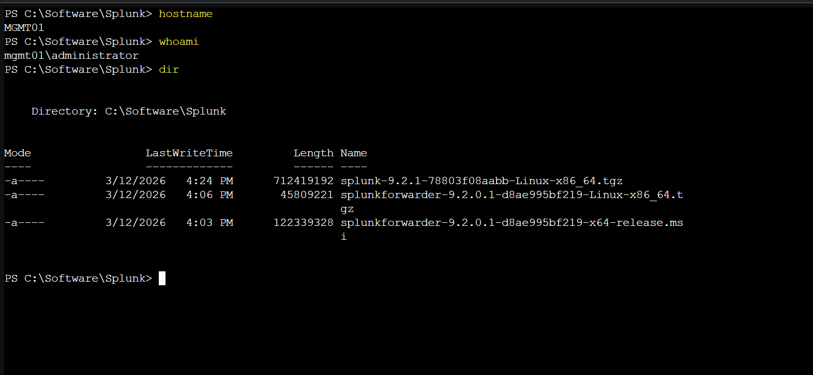
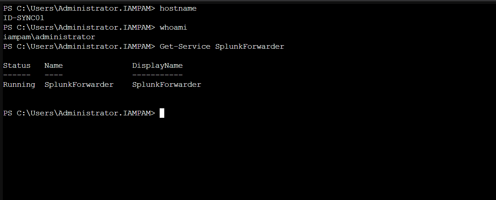
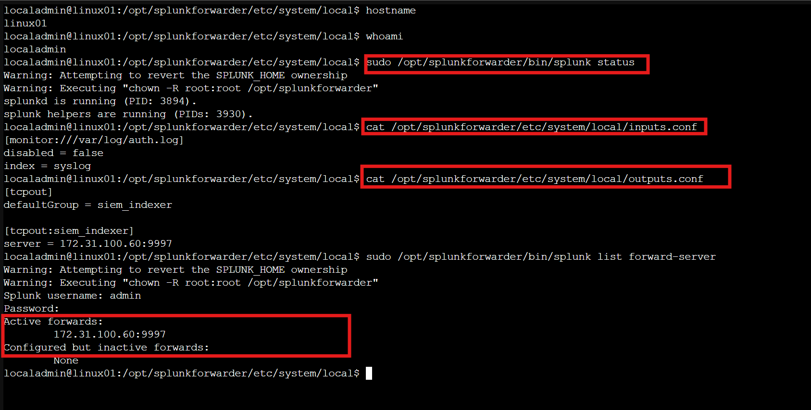
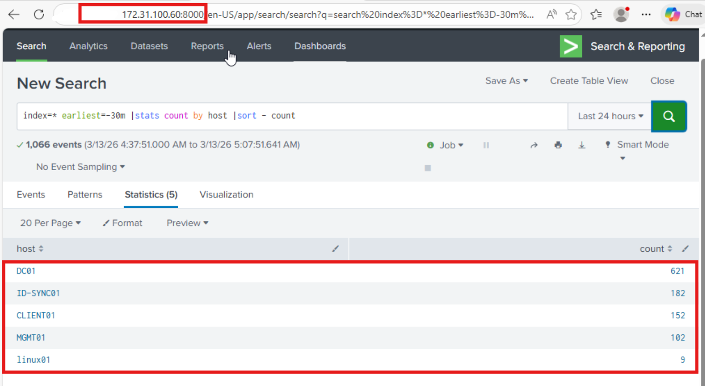
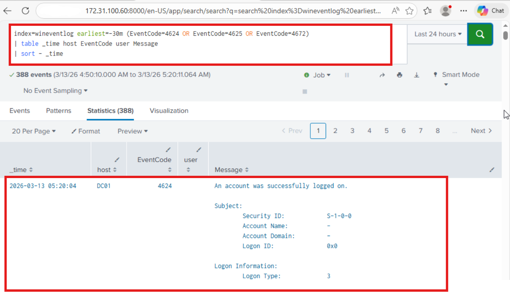
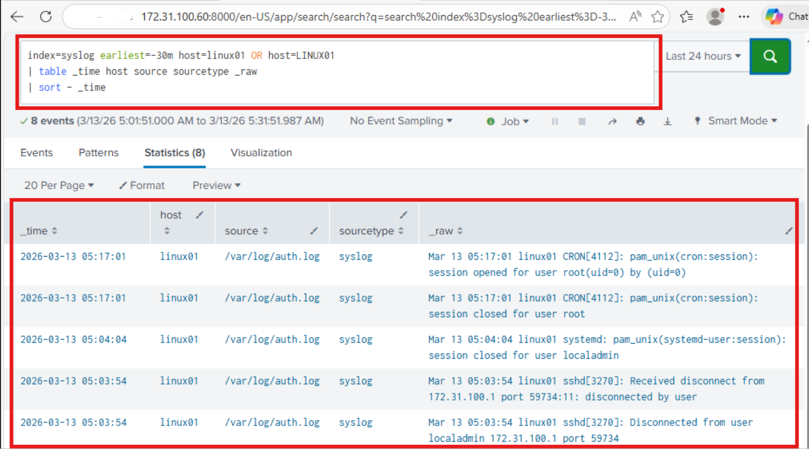

← [Back to Main README](../README.md)

---


---

# Module 07: IAM & PAM Logging / Incident Response

**Module**: 07 - IAM & PAM Logging / Incident Response
**Status**: ✅ COMPLETE (Identity Monitoring & Incident Detection Validated)
**Built by**: Edward E. Spence
**Completed**: March 2026
**Purpose**: Implement centralized identity monitoring and incident detection within the hybrid identity architecture using Splunk Enterprise, enabling visibility into authentication events, privileged access activity, and cross-platform identity telemetry.

---

## Overview

Module 07 introduces **centralized identity monitoring and incident detection** within the hybrid identity architecture.

Previous modules established the foundation of the identity platform:

• Active Directory authentication infrastructure
• Hybrid identity synchronization with Microsoft Entra ID
• Identity governance controls
• Privileged access management and administrative workstation enforcement

With these controls in place, the next phase focuses on **visibility and detection**.

Identity systems generate critical security telemetry during authentication and privileged access operations. Monitoring this activity allows administrators to detect:

• abnormal authentication behavior
• failed login attempts
• privileged account activity
• group membership changes
• elevated command execution on Linux systems

In this module, authentication telemetry from Windows and Linux systems is centralized using **Splunk Enterprise**.

This allows the identity platform to detect suspicious activity and investigate potential identity-related security incidents.

---

# Architecture Context

The logging architecture integrates directly with the existing **IAMPAM.LAB identity network**.

```id="logflow1"
Identity Systems
        ↓
Splunk Universal Forwarders
        ↓
TCP 9997
        ↓
SIEM01 — Splunk Enterprise
```

Forwarders installed on identity infrastructure systems transmit authentication logs to the central monitoring server.

---

## Systems Providing Identity Telemetry

| System    | Role                       | Identity Signals Collected                      |
| --------- | -------------------------- | ----------------------------------------------- |
| DC01      | Domain Controller          | Authentication events, group membership changes |
| MGMT01    | Administrative Workstation | Privileged logins                               |
| CLIENT01  | Domain Workstation         | User authentication activity                    |
| ID-SYNC01 | Entra Connect Server       | Administrative access activity                  |
| LINUX01   | Privileged Linux Server    | sudo usage and authentication logs              |

---

## Identity Monitoring Objectives

The monitoring platform provides visibility into:

• Windows authentication events
• privileged administrative logins
• failed login attempts
• privileged group membership changes
• Linux privileged command execution
• centralized identity telemetry across the environment

This telemetry allows administrators to investigate potential identity abuse.

---

# Implementation

## Step 1 — Splunk Enterprise Installation

### Evidence



---

## Step 2 — Splunk Log Receiver Configuration

```id="logstep2"
TCP 9997
```

### Evidence



---

## Step 3 — Identity Log Index Creation

```id="logstep3"
wineventlog
syslog
```

### Evidence



---

## Step 4 — Forwarder Deployment Staging

```id="logstep4"
C:\Software\Splunk
```

### Evidence



---

## Step 5 — Windows Forwarder Deployment

```id="logstep5"
DC01
CLIENT01
MGMT01
ID-SYNC01
```

### Evidence



---

## Step 6 — Linux Forwarder Deployment

```id="logstep6"
/var/log/auth.log
```

### Evidence



---

## Step 7 — SIEM Host Visibility Verification

```id="logstep7"
index=* earliest=-30m
| stats count by host
| sort -count
```

### Evidence



---

## Step 8 — Windows Authentication Event Monitoring

| Event ID | Description      |
| -------- | ---------------- |
| 4624     | Successful login |
| 4625     | Failed login     |
| 4672     | Privileged login |

```id="logstep8"
index=wineventlog earliest=-30m (EventCode=4624 OR EventCode=4625 OR EventCode=4672)
| table _time host EventCode user Message
```

### Evidence



---

## Step 9 — Linux Authentication Monitoring

```id="logstep9"
index=syslog host=linux01
| table _time host source _raw
```

### Evidence



---

# Engineering Notes & Lessons Learned

### Windows vs Linux Forwarder Initialization

Windows forwarders used MSI silent install.
Linux required manual first-run admin setup.

---

### Config Files Not Created by Default

```
inputs.conf
outputs.conf
```

Manually created to define ingestion + forwarding.

---

### PowerShell Execution Behavior

```
& "path\to\executable"
```

Required for Program Files paths.

---

### Network Prerequisites

• SMB (445)
• WinRM
• Splunk 9997

---

### Forwarder Verification

Windows:

```
Get-Service SplunkForwarder
splunk.exe list forward-server
```

Linux:

```
splunk status
splunk list forward-server
```

---

# Security Controls Demonstrated

* Authentication activity monitoring
* Failed login detection
* Privileged login monitoring
* Linux sudo activity monitoring
* Centralized identity telemetry
* Cross-platform authentication visibility
* SIEM-based investigation capability

---

# Summary

Module 07 establishes **identity monitoring and incident investigation capabilities** within the hybrid identity platform.

Authentication telemetry from Windows and Linux systems is centralized in Splunk Enterprise, allowing administrators to monitor login activity, detect privileged access usage, and investigate suspicious authentication behavior.

This completes the monitoring layer required for a mature identity security architecture.

---

# Next Module

Module 08 introduces **identity automation and policy enforcement**

---

---

**E.E. Spence — Identity Engineering | IAMPAM.LAB**
