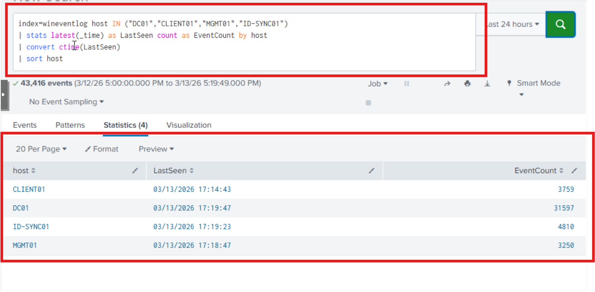
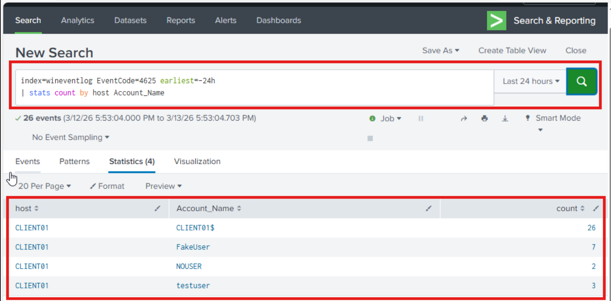
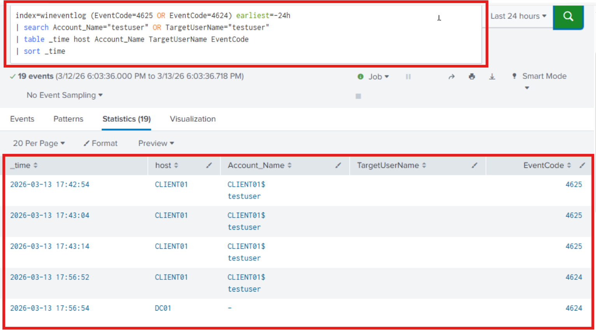
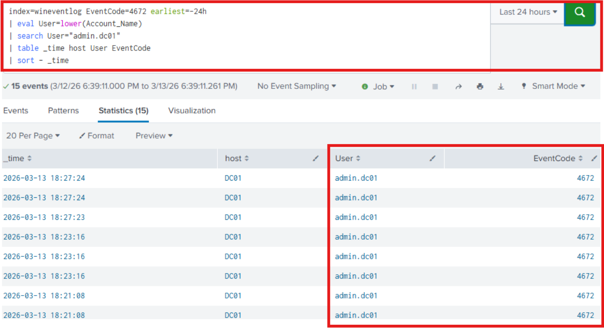
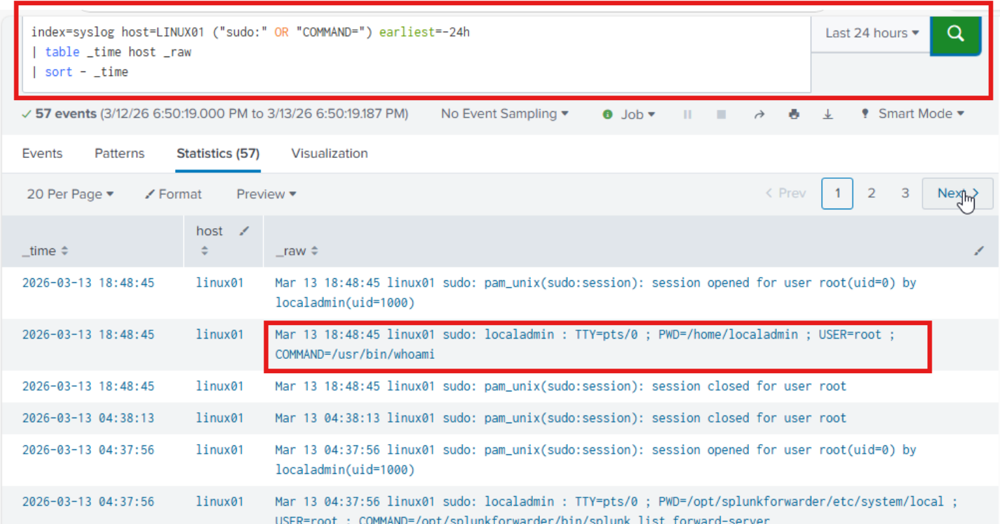
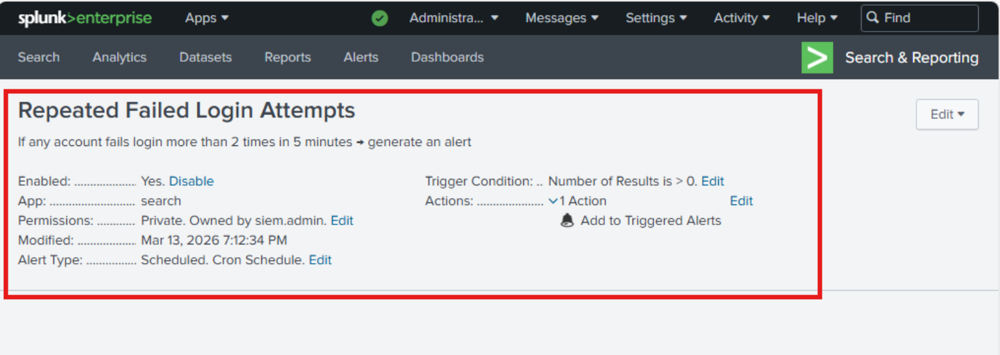
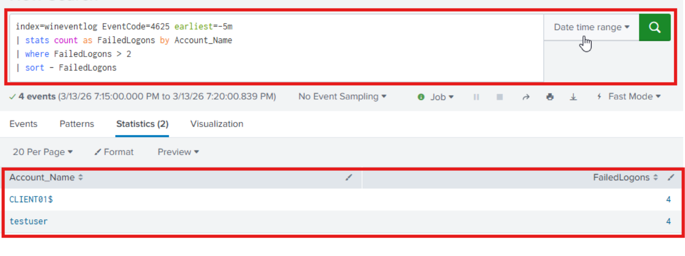

← [Back to Main README](../README.md)

---


---

# Module 08: Identity Automation & Policy Enforcement

**Module**: 08 - Identity Automation & Policy Enforcement
**Status**: ✅ COMPLETE (Identity Automation & Policy Enforcement Validated)
**Built by**: Edward E. Spence
**Completed**: March 2026
**Purpose**: Implement automated identity monitoring and enforcement within the hybrid identity architecture using Splunk scheduled detections, enabling automated detection of suspicious authentication behavior and alert generation across Windows and Linux identity systems.

---

## Overview

Module 08 introduces **automated identity monitoring and enforcement** within the IAMPAM.LAB environment using Splunk scheduled detections.

Previous modules established the foundation of the identity platform:

• Active Directory authentication authority
• Hybrid identity federation
• Privileged access management controls
• Centralized log ingestion using Splunk

With centralized identity telemetry already available, this module introduces the **automation layer** of the identity monitoring architecture.

The objective of this module is to demonstrate how security operations teams detect authentication anomalies and automate response workflows using SIEM detection rules.

This capability allows the identity platform to automatically identify:

• repeated failed login attempts
• suspicious authentication sequences
• privileged account activity
• Linux privilege escalation events

---

# Architecture Context

```id="auto_flow"
Windows / Linux Hosts
        ↓
Splunk Universal Forwarder
        ↓
TCP 9997
        ↓
SIEM01 — Splunk Enterprise
        ↓
Scheduled Detection Searches
        ↓
Automated Alerts
```

---

## Systems Providing Identity Telemetry

| System    | Role                       |
| --------- | -------------------------- |
| DC01      | Domain Controller          |
| MGMT01    | Administrative Workstation |
| CLIENT01  | Domain Workstation         |
| LINUX01   | Privileged Linux Server    |
| ID-SYNC01 | Entra Connect Server       |
| SIEM01    | Splunk Enterprise          |

Network segment:

```id="netseg"
172.31.100.0/24
```

---

## Identity Automation Objectives

• repeated failed authentication attempts
• suspicious login patterns
• privileged logon activity
• Linux privilege escalation events
• abnormal identity behavior

---

# Implementation

## Step 1 — Windows Log Ingestion Validation

```id="auto_q1"
index=wineventlog host IN ("DC01","CLIENT01","MGMT01","ID-SYNC01") earliest=-24h
| stats latest(_time) as LastSeen count as EventCount by host
| convert ctime(LastSeen)
| sort host
```

### Evidence



---

## Step 2 — Failed Login Detection

```id="auto_q2"
index=wineventlog EventCode=4625 earliest=-24h
| stats count as FailedLogons by host Account_Name
| rename Account_Name as User
| sort - FailedLogons
```

### Evidence



---

## Step 3 — Authentication Sequence Investigation

```id="auto_q3"
index=wineventlog (EventCode=4625 OR EventCode=4624) earliest=-24h
| search Account_Name="testuser"
| table _time host Account_Name EventCode
| sort _time
```

### Evidence



---

## Step 4 — Privileged Logon Detection

```id="auto_q4"
index=wineventlog EventCode=4672 earliest=-24h
| eval User=lower(Account_Name)
| search User="admin.dc01"
| table _time host User EventCode
| sort - _time
```

### Evidence



---

## Step 5 — Linux Privilege Escalation Monitoring

```id="auto_q5"
index=syslog host=LINUX01 ("sudo:" OR "COMMAND=") earliest=-24h
| table _time host _raw
| sort - _time
```

### Evidence



---

## Step 6 — Automated Detection Rule Creation

```id="auto_q6"
index=wineventlog EventCode=4625 earliest=-5m
| stats count as FailedLogons by Account_Name
| where FailedLogons > 2
| sort - FailedLogons
```

| Setting           | Value                 |
| ----------------- | --------------------- |
| Alert Type        | Scheduled             |
| Schedule          | Cron (*/5 * * * *)    |
| Time Range        | Last 15 minutes       |
| Trigger Condition | Number of Results > 0 |
| Trigger           | Once                  |

### Evidence



---

## Step 7 — Alert Trigger Validation

Validation workflow:

1. Generate failed logins
2. Event 4625 created
3. Scheduled search runs
4. Alert triggers

### Evidence



---

# Security Controls Demonstrated

* Automated failed login detection
* Authentication sequence investigation
* Privileged login monitoring
* Linux privilege escalation monitoring
* SIEM alert automation
* Cross-platform identity monitoring

---

# Summary

Module 08 completes the **automation layer of identity monitoring** within the hybrid identity platform.

The SIEM now continuously evaluates authentication telemetry and automatically generates alerts when suspicious identity activity occurs.

---

# Next Phase

The environment now demonstrates a full identity security lifecycle:

• identity infrastructure
• hybrid federation
• governance
• PAM
• monitoring
• automated detection

---


---

**E.E. Spence — Identity Engineering | IAMPAM.LAB**
