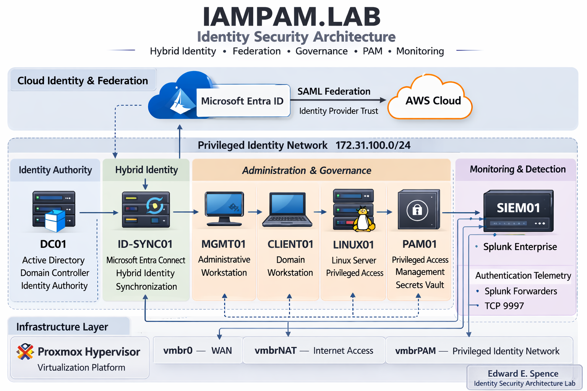

← [Back to Main README](../README.md)

---


---

# Module 09: Documentation & Architecture

**Module:** 09 - Documentation & Architecture
**Status:** ✅ COMPLETE
**Environment:** IAMPAM.LAB
**Repository:** HYBRID-IDENTITY-ACCESS-MGMT
**Author:** Edward E. Spence
**Completion Date:** March 2026

---

# Overview

Module 09 serves as the architectural consolidation phase of the **IAMPAM.LAB** identity security environment.

Previous modules implemented the individual components of the identity platform including infrastructure, identity authority, hybrid identity synchronization, federation, governance, privileged access management, centralized monitoring, and automated detection.

This module documents the **entire environment as a unified identity security architecture**, explaining how each system interacts with the others and how the design reflects real-world enterprise identity security practices.

Rather than describing the lab as a sequence of isolated builds, this module explains the environment as a **layered identity control plane** that governs authentication, authorization, monitoring, and detection across the organization.

---

## Architecture Overview



The **IAMPAM.LAB** environment represents a simulated enterprise identity security architecture designed to demonstrate how modern organizations structure and secure identity infrastructure across on-premises systems, hybrid identity platforms, federated cloud services, governance controls, privileged access boundaries, centralized monitoring, and automated detection.

Rather than existing as isolated technical exercises, the components implemented in Modules 01 through 08 operate as a **single integrated identity security system**.

At the core of the architecture is **Active Directory**, which functions as the authoritative identity provider for on-premises authentication. Hybrid identity synchronization extends this identity authority into **Microsoft Entra ID**, allowing cloud services to authenticate the same identity objects used internally.

Federated trust relationships allow external services, such as **Amazon Web Services**, to rely on Entra ID for authentication using SAML-based federation. Governance and Privileged Access Management layers enforce access control policies that regulate who may access systems and how elevated privileges are assigned.

Operational visibility is provided through **centralized identity telemetry collection using Splunk**, allowing authentication and privilege events across Windows and Linux systems to be monitored and investigated. Automated detection logic further enhances the architecture by transforming authentication telemetry into security alerts.

The resulting architecture models the identity control plane commonly used in enterprise environments where identity systems serve as the foundation for security, access governance, and operational monitoring.

---

# Infrastructure Layer

The infrastructure layer provides the compute, networking, and virtualization foundation upon which all identity services operate.

The entire IAMPAM.LAB environment is hosted on a **Proxmox virtualization platform**, which functions as the hypervisor responsible for running all identity and security infrastructure systems.

The environment uses a segmented network architecture designed to separate identity infrastructure from external exposure.

Primary internal network:

```
172.31.100.0/24
```

---

# Identity Authority Layer (Active Directory)

Active Directory Domain Services on **DC01** provides:

• Kerberos authentication
• LDAP directory services
• DNS resolution
• security policy enforcement

This is the **trust anchor of the entire environment**.

---

# Hybrid Identity Layer (Microsoft Entra Connect)

Implemented via:

```
ID-SYNC01
```

Key design:

• Password Hash Synchronization (PHS)
• Scoped sync using **AAD-Sync-Users**
• Controlled identity exposure

---

# Federation Layer (Entra → AWS SAML)

Authentication flow:

1. User authenticates to Entra
2. SAML assertion generated
3. AWS validates assertion
4. STS issues temporary session

Result:

✔ No local AWS IAM users
✔ Centralized identity control

---

# Governance Layer (RBAC)

Access model:

• Group-based access (no direct assignment)
• Joiner / Mover / Leaver lifecycle
• Separation of Duties enforced

---

# Privileged Access Management Layer

Controls implemented:

• Privileged-Accounts OU
• PAM security groups
• MGMT01 admin workstation enforcement
• Linux sudo privilege model

---

# Monitoring Layer (Splunk)

Central SIEM:

```
SIEM01
```

Data ingestion:

```
TCP 9997
```

Collected telemetry:

• Windows logon events
• privileged activity
• SSH + sudo logs

---

# Automation Layer (Detection Engineering)

Splunk detections identify:

• brute force attempts
• login anomalies
• privileged account usage
• Linux privilege escalation

---

# Final Architecture Validation

✔ Active Directory authentication verified
✔ Hybrid sync operational
✔ AWS federation working
✔ RBAC enforced
✔ PAM controls validated
✔ Splunk ingesting logs
✔ Alerts triggering successfully

---

# Evidence & Screenshots

| Screenshot                               | Description                                  |
| ---------------------------------------- | -------------------------------------------- |
| module9_01_full_architecture_diagram.png | Final architecture diagram                   |
| module9_02_identity_flow.png             | Identity synchronization and federation flow |
| module9_03_federated_login.png           | AWS federated login validation               |
| module9_04_siem_visibility.png           | Splunk telemetry visibility                  |
| module9_05_detection_alert.png           | Detection alert triggered                    |

Location:

```
screenshots/module-09/
```

---

# Summary

Module 09 consolidates the environment into a complete enterprise identity security architecture.

This system demonstrates:

• identity authority
• hybrid identity
• federation
• governance
• PAM
• monitoring
• automation

Together forming a **real-world IAM/PAM security control plane**.

---


---

**E.E. Spence — Identity Engineering | IAMPAM.LAB**
