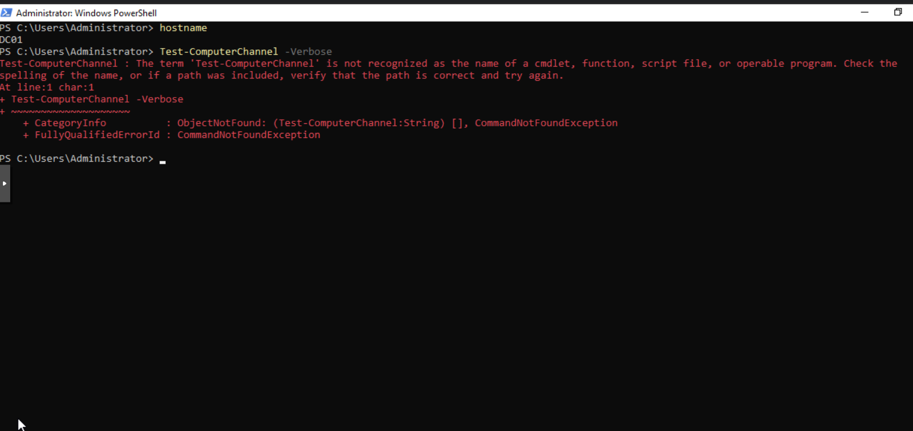
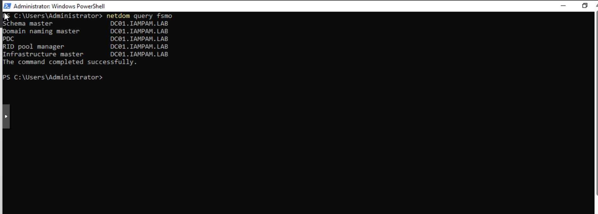
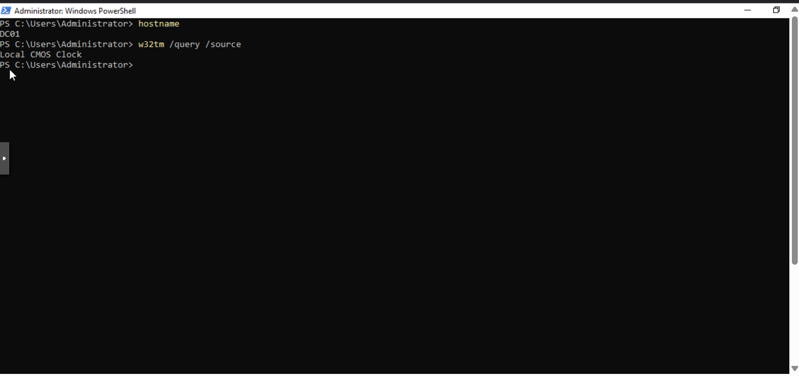

← [Back to Main README](../README.md)

---


---

# Active Directory Authentication Recovery — Secure Channel & Kerberos Time Hierarchy

**Maintained by:** Edward E. Spence
**Environment:** Fairmont Manufacturing Identity Security Lab
**Document Type:** IAM Operations Runbook
**Last Reviewed:** February 2026

| Field         | Value                           |
| ------------- | ------------------------------- |
| Runbook ID    | AD-OPS-REC-001                  |
| Service       | Active Directory Authentication |
| Environment   | IAMPAM.LAB                      |
| Owner         | Identity & Access Management    |
| Severity      | SEV-1 Authentication Failure    |
| Version       | 2.0                             |
| Last Reviewed | 2026-02-20                      |

---

## 1. Purpose

This runbook provides the recovery procedure for domain authentication failures caused by an invalid Kerberos time hierarchy or a broken workstation secure channel.

In Active Directory, Kerberos authentication depends on synchronized time between the domain controller and domain members.
The PDC Emulator acts as the domain time authority.

If the PDC Emulator uses the Local CMOS Clock or an unreachable time source, authentication may fail even while the domain controller remains online.

---

## 2. When To Use This Runbook

Use this procedure if domain authentication fails but systems remain powered on and reachable.

Common indicators:

• Users cannot log in with valid domain credentials
• RDP authentication fails
• “Trust relationship between this workstation and the primary domain failed”
• Kerberos ticket issuance fails
• `Test-ComputerSecureChannel` returns False

---

## 3. Initial Verification (Workstation)

Log into the affected workstation using the **local administrator account**.

Open elevated PowerShell:

```powershell
Test-ComputerSecureChannel -Verbose
```

### Evidence



If the output is:

```
False
```

Continue with this runbook.

---

## 4. Confirm Domain Controller Availability

From the workstation:

```powershell
ping DC01
nslookup DC01.IAMPAM.LAB
```

If DC01 is unreachable, this is not a Kerberos issue — it is a domain controller availability issue.

If reachable, continue.

---

## 5. Identify the Domain Time Authority

On DC01:

```powershell
netdom query fsmo
```

### Evidence



Confirm DC01 holds the **PDC Emulator** role.

The PDC Emulator is the authoritative time source for the domain.

---

## 6. Verify Domain Controller Time Source

On DC01:

```powershell
w32tm /query /source
```

### Evidence



If the result is:

```
Local CMOS Clock
```

the domain time hierarchy is invalid and Kerberos authentication will fail.

---

## 7. Correct the Domain Time Hierarchy

The domain controller must not synchronize directly with the internet in this environment.

The correct architecture is:

```
External NTP → MGMT01 → DC01 → Domain Members
```

MGMT01 functions as the internal NTP relay.

---

### 7.1 Verify MGMT01 Time Source

On MGMT01:

```powershell
w32tm /query /source
```

Expected:
An external NTP source (pool.ntp.org or equivalent)

If MGMT01 is not synchronized, correct MGMT01 first.

---

### 7.2 Configure DC01 to Use MGMT01

On DC01:

Stop the time service:

```powershell
net stop w32time
```

Configure MGMT01 as the time source:

```powershell
w32tm /config /manualpeerlist:"172.31.100.20,0x8" /syncfromflags:manual /reliable:yes /update
```

Start the service:

```powershell
net start w32time
```

Force synchronization:

```powershell
w32tm /resync /rediscover
```

Verify:

```powershell
w32tm /query /source
```

Expected result:

```
172.31.100.20
```

---

## 8. Repair the Workstation Secure Channel

Return to the affected workstation.

Run:

```powershell
Test-ComputerSecureChannel -Repair -Credential IAMPAM\Administrator
```

Expected:

```
True
```

---

## 9. Validate Kerberos Authentication

Clear cached tickets:

```powershell
klist purge
```

Request new tickets:

```powershell
klist
```

A `krbtgt` ticket issued by `DC01.IAMPAM.LAB` must appear.

---

## 10. Resolution Confirmation

Authentication is restored when:

• Domain login succeeds
• `Test-ComputerSecureChannel` returns True
• Kerberos tickets are issued
• Trust relationship errors stop

---

## 11. Preventative Monitoring

On DC01 periodically verify:

```powershell
w32tm /query /source
```

The source must NEVER be:

```
Local CMOS Clock
```

---

## 12. Key Operational Principle

In Active Directory:

**If time is wrong, authentication is wrong.**

Kerberos is a time-based authentication protocol.
The PDC Emulator must always have a reliable upstream time authority.

---

**E.E. Spence — Identity Engineering | IAMPAM.LAB**
