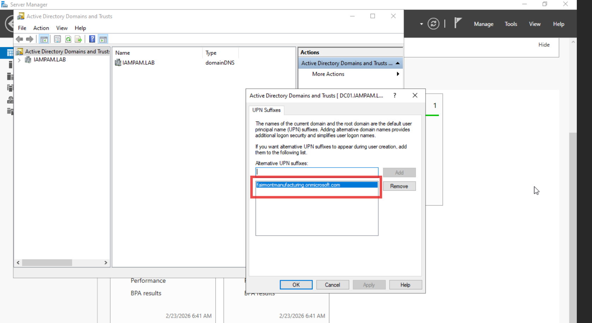
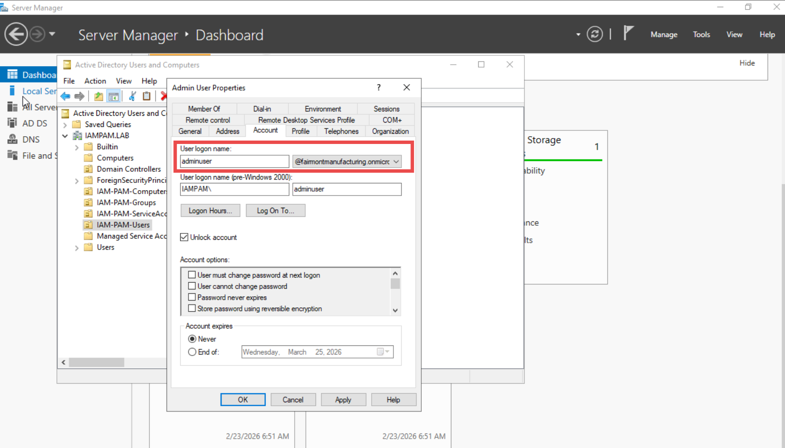
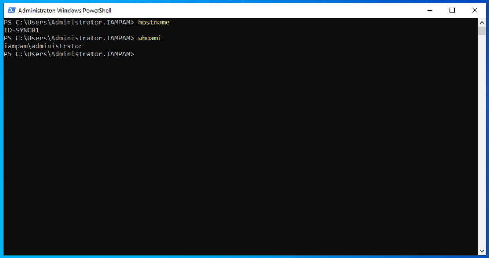
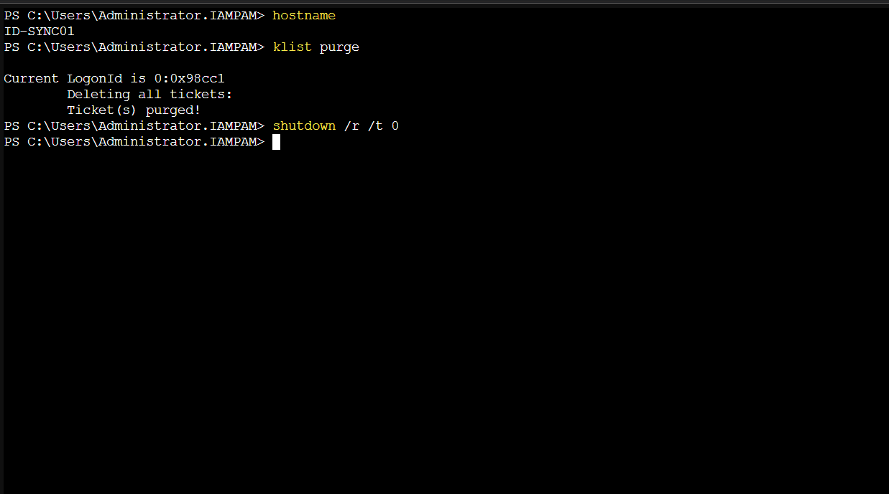
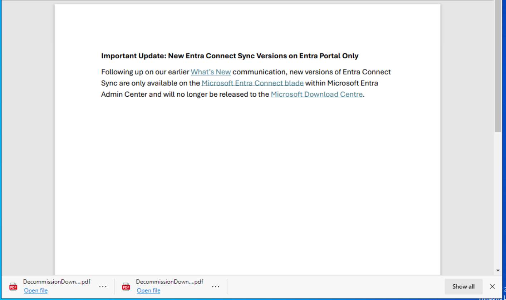
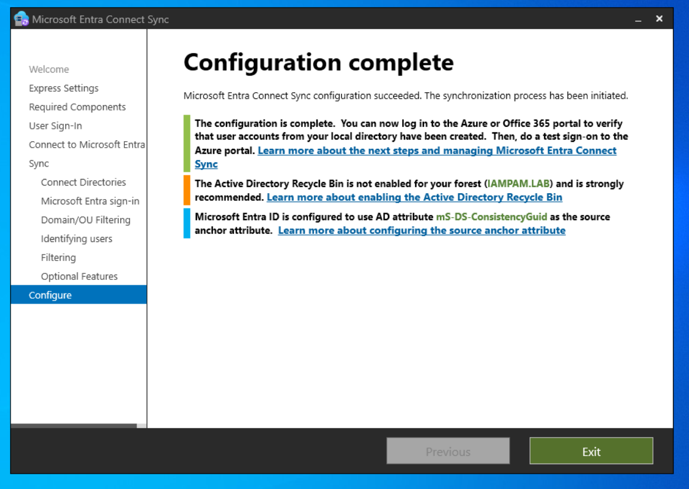
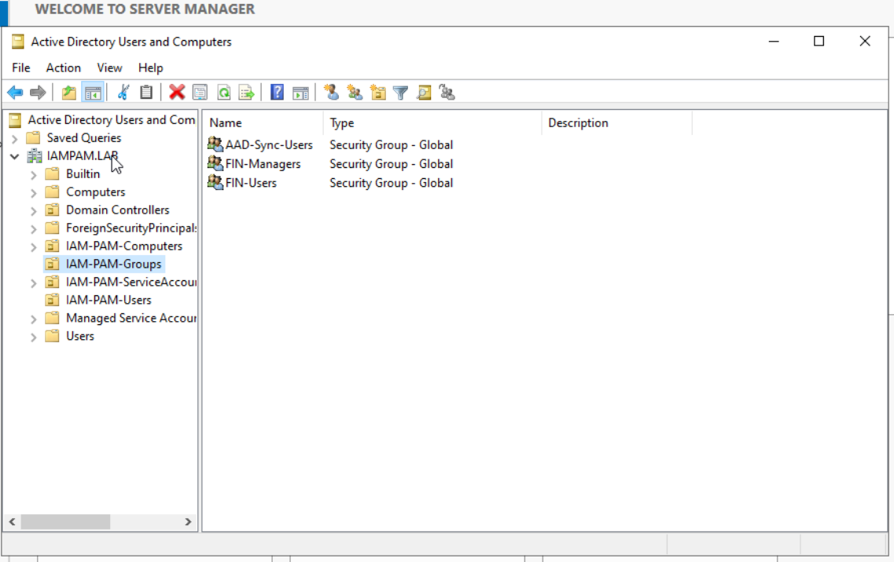
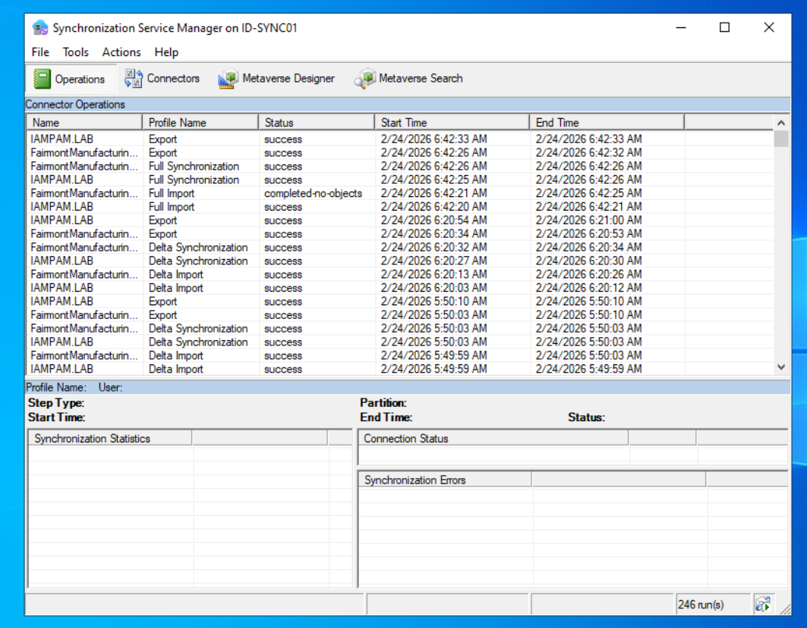
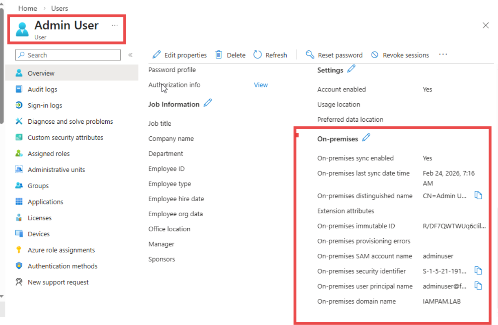

← [Back to Main README](../../README.md)

---


---

# Entra Connect UPN Namespace Mismatch Recovery Runbook

## Incident: Microsoft Entra Connect Authentication Failure ("Unsupported Browser")

**Maintained by:** Edward E. Spence
**Environment:** Fairmont Manufacturing Identity Security Lab
**Document Type:** IAM Operations Runbook
**Last Reviewed:** February 2026

---

## Runbook Metadata

| Field      | Value                           |
| ---------- | ------------------------------- |
| Runbook ID | HYB-OPS-REC-001                 |
| Service    | Hybrid Identity Synchronization |
| Severity   | SEV-1 Authentication Failure    |
| Status     | Resolved                        |
| Version    | 1.0                             |

---

## Executive Summary

Failure caused by **UPN namespace mismatch** between AD and Entra ID.
Not a browser issue — identity architecture issue.

---

## Root Cause

```text
IAMPAM.LAB  ❌
fairmontmanufacturing.onmicrosoft.com ✅
```

---

## Recovery Procedure

### Step 1 — Add UPN Suffix



---

### Step 2 — Update Administrator UPN



---

### Step 3 — Verify Domain Context



---

### Step 4 — Kerberos Reset



---

### Step 5 — Entra Connect Execution





---

## Scoped Synchronization



---

## Validation





---

## Closure Criteria

✔ Authentication successful
✔ Sync operational
✔ Users visible in Entra
✔ On-Prem Sync verified

---

**E.E. Spence — Identity Engineering | IAMPAM.LAB**
